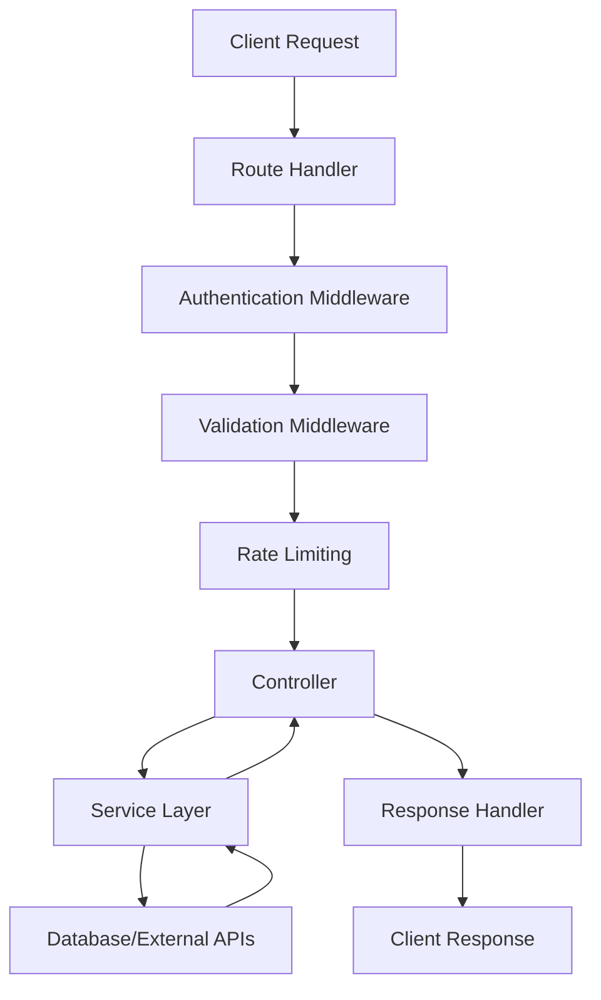
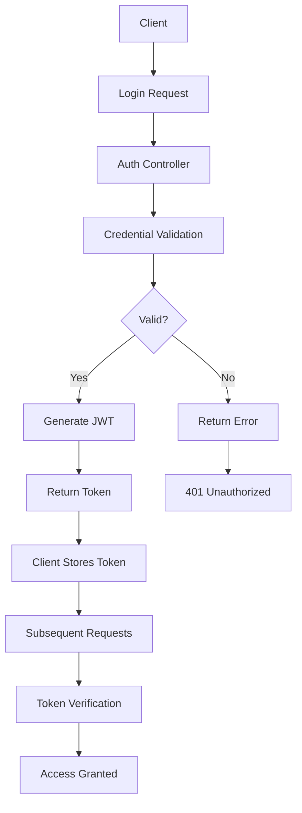
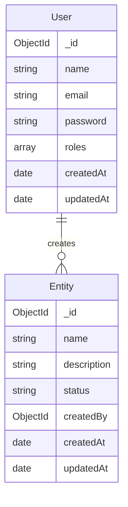
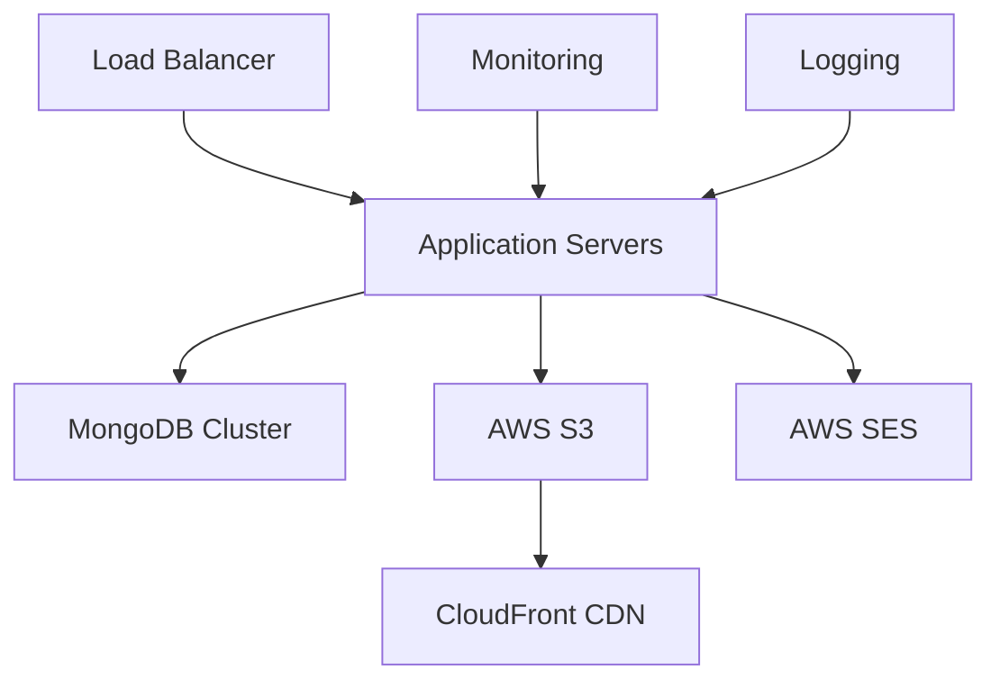

# Documentation Generation Command

Generate comprehensive API documentation from code analysis, including endpoints, schemas, and usage examples.

## Usage

```bash
/org:docs:generate [--type=api|architecture|readme] [--output=docs/] [--format=markdown|html]
```

## Parameters

- `--type`: Type of documentation to generate (default: api)
  - `api`: API endpoint documentation
  - `architecture`: System architecture documentation
  - `readme`: Enhanced README with full project documentation
- `--output`: Output directory (default: docs/)
- `--format`: Output format (default: markdown)

## Implementation

```bash
#!/bin/bash

DOC_TYPE="api"
OUTPUT_DIR="docs"
FORMAT="markdown"

# Parse flags
for arg in "$@"; do
    case $arg in
        --type=*)
            DOC_TYPE="${arg#*=}"
            ;;
        --output=*)
            OUTPUT_DIR="${arg#*=}"
            ;;
        --format=*)
            FORMAT="${arg#*=}"
            ;;
    esac
done

echo "📚 Generating $DOC_TYPE documentation..."
echo "📁 Output: $OUTPUT_DIR/"
echo "📄 Format: $FORMAT"

# Check if we're in a valid project
if [[ ! -f "package.json" ]]; then
    echo "❌ Error: Not in a valid Node.js project directory"
    echo "Please run this command from the project root"
    exit 1
fi

# Create output directory
mkdir -p "$OUTPUT_DIR"

# Function to generate API documentation
generate_api_docs() {
    echo "🔍 Analyzing API structure..."
    
    # Create API documentation
    cat > "$OUTPUT_DIR/api-documentation.md" << 'EOF'
# API Documentation

## Overview

This document provides comprehensive documentation for all API endpoints, including request/response formats, authentication requirements, and usage examples.

## Base URL

```
Development: http://localhost:5000/api
Production: [Your production URL]
```

## Authentication

Most endpoints require authentication. Include the JWT token in the Authorization header:

```
Authorization: Bearer <your-jwt-token>
```

### Master API Keys

Some administrative endpoints require master API keys:

```
x-api-key: <your-master-api-key>
```

## Response Format

All API responses follow a consistent format:

### Success Response
```json
{
  "success": true,
  "message": "Operation completed successfully",
  "data": {
    // Response data
  }
}
```

### Error Response
```json
{
  "success": false,
  "message": "Error description",
  "error": {
    // Error details (development only)
  }
}
```

## Pagination

List endpoints support pagination with the following query parameters:

- `page`: Page number (default: 1)
- `limit`: Items per page (default: 10, max: 100)
- `sort`: Sort field with optional direction (e.g., `-createdAt`)

### Pagination Response
```json
{
  "success": true,
  "data": {
    "items": [...],
    "pagination": {
      "page": 1,
      "limit": 10,
      "total": 50,
      "pages": 5
    }
  }
}
```

EOF

    # Analyze routes and generate endpoint documentation
    if [[ -d "api/routes" ]]; then
        echo "🔍 Scanning route files..."
        
        for route_file in api/routes/*.js; do
            if [[ -f "$route_file" ]]; then
                filename=$(basename "$route_file" .js)
                entity_name=$(echo "$filename" | sed 's/Routes$//' | sed 's/routes$//')
                
                echo "📝 Documenting $entity_name endpoints..."
                
                # Extract route information
                cat >> "$OUTPUT_DIR/api-documentation.md" << EOF

## ${entity_name^} Endpoints

### Base Path: \`/api/${entity_name,,}s\`

EOF
                
                # Analyze route file for endpoints
                if grep -q "router.get('/'," "$route_file"; then
                    cat >> "$OUTPUT_DIR/api-documentation.md" << EOF
#### GET /${entity_name,,}s
Get all ${entity_name,,}s with pagination and filtering.

**Authentication:** Required

**Query Parameters:**
- \`page\` (optional): Page number
- \`limit\` (optional): Items per page
- \`status\` (optional): Filter by status
- \`sort\` (optional): Sort field

**Example Request:**
\`\`\`bash
curl -X GET "http://localhost:5000/api/${entity_name,,}s?page=1&limit=10" \\
  -H "Authorization: Bearer <token>"
\`\`\`

**Example Response:**
\`\`\`json
{
  "success": true,
  "message": "${entity_name^}s retrieved successfully",
  "data": {
    "${entity_name,,}s": [
      {
        "_id": "60d5ec49f1b2c72b1c8e4e7a",
        "name": "Example ${entity_name^}",
        "status": "active",
        "createdAt": "2024-01-01T00:00:00.000Z",
        "updatedAt": "2024-01-01T00:00:00.000Z"
      }
    ],
    "pagination": {
      "page": 1,
      "limit": 10,
      "total": 1,
      "pages": 1
    }
  }
}
\`\`\`

EOF
                fi
                
                if grep -q "router.get('/:id'," "$route_file"; then
                    cat >> "$OUTPUT_DIR/api-documentation.md" << EOF
#### GET /${entity_name,,}s/:id
Get a specific ${entity_name,,} by ID.

**Authentication:** Required

**Parameters:**
- \`id\` (required): ${entity_name^} ID

**Example Request:**
\`\`\`bash
curl -X GET "http://localhost:5000/api/${entity_name,,}s/60d5ec49f1b2c72b1c8e4e7a" \\
  -H "Authorization: Bearer <token>"
\`\`\`

**Example Response:**
\`\`\`json
{
  "success": true,
  "message": "${entity_name^} retrieved successfully",
  "data": {
    "_id": "60d5ec49f1b2c72b1c8e4e7a",
    "name": "Example ${entity_name^}",
    "status": "active",
    "createdAt": "2024-01-01T00:00:00.000Z",
    "updatedAt": "2024-01-01T00:00:00.000Z"
  }
}
\`\`\`

EOF
                fi
                
                if grep -q "router.post('/'," "$route_file"; then
                    cat >> "$OUTPUT_DIR/api-documentation.md" << EOF
#### POST /${entity_name,,}s
Create a new ${entity_name,,}.

**Authentication:** Required

**Request Body:**
\`\`\`json
{
  "name": "New ${entity_name^}",
  "description": "Optional description",
  "status": "active"
}
\`\`\`

**Example Request:**
\`\`\`bash
curl -X POST "http://localhost:5000/api/${entity_name,,}s" \\
  -H "Authorization: Bearer <token>" \\
  -H "Content-Type: application/json" \\
  -d '{
    "name": "New ${entity_name^}",
    "description": "Example description",
    "status": "active"
  }'
\`\`\`

**Example Response:**
\`\`\`json
{
  "success": true,
  "message": "${entity_name^} created successfully",
  "data": {
    "_id": "60d5ec49f1b2c72b1c8e4e7a",
    "name": "New ${entity_name^}",
    "description": "Example description",
    "status": "active",
    "createdAt": "2024-01-01T00:00:00.000Z",
    "updatedAt": "2024-01-01T00:00:00.000Z"
  }
}
\`\`\`

EOF
                fi
                
                if grep -q "router.put('/:id'," "$route_file"; then
                    cat >> "$OUTPUT_DIR/api-documentation.md" << EOF
#### PUT /${entity_name,,}s/:id
Update an existing ${entity_name,,}.

**Authentication:** Required

**Parameters:**
- \`id\` (required): ${entity_name^} ID

**Request Body:**
\`\`\`json
{
  "name": "Updated ${entity_name^}",
  "description": "Updated description",
  "status": "inactive"
}
\`\`\`

**Example Request:**
\`\`\`bash
curl -X PUT "http://localhost:5000/api/${entity_name,,}s/60d5ec49f1b2c72b1c8e4e7a" \\
  -H "Authorization: Bearer <token>" \\
  -H "Content-Type: application/json" \\
  -d '{
    "name": "Updated ${entity_name^}",
    "status": "inactive"
  }'
\`\`\`

EOF
                fi
                
                if grep -q "router.delete('/:id'," "$route_file"; then
                    cat >> "$OUTPUT_DIR/api-documentation.md" << EOF
#### DELETE /${entity_name,,}s/:id
Delete a ${entity_name,,}.

**Authentication:** Required

**Parameters:**
- \`id\` (required): ${entity_name^} ID

**Example Request:**
\`\`\`bash
curl -X DELETE "http://localhost:5000/api/${entity_name,,}s/60d5ec49f1b2c72b1c8e4e7a" \\
  -H "Authorization: Bearer <token>"
\`\`\`

EOF
                fi
                
                if grep -q "router.get('/search'," "$route_file"; then
                    cat >> "$OUTPUT_DIR/api-documentation.md" << EOF
#### GET /${entity_name,,}s/search
Search ${entity_name,,}s by name or description.

**Authentication:** Required

**Query Parameters:**
- \`q\` (required): Search term
- \`page\` (optional): Page number
- \`limit\` (optional): Items per page

**Example Request:**
\`\`\`bash
curl -X GET "http://localhost:5000/api/${entity_name,,}s/search?q=example" \\
  -H "Authorization: Bearer <token>"
\`\`\`

EOF
                fi
            fi
        done
    fi
    
    # Add error codes section
    cat >> "$OUTPUT_DIR/api-documentation.md" << 'EOF'

## Error Codes

| Status Code | Description |
|-------------|-------------|
| 200 | OK - Request successful |
| 201 | Created - Resource created successfully |
| 400 | Bad Request - Invalid request data |
| 401 | Unauthorized - Authentication required |
| 403 | Forbidden - Insufficient permissions |
| 404 | Not Found - Resource not found |
| 409 | Conflict - Resource already exists |
| 422 | Unprocessable Entity - Validation error |
| 429 | Too Many Requests - Rate limit exceeded |
| 500 | Internal Server Error - Server error |

## Rate Limiting

API endpoints are rate limited to prevent abuse:

- **Default**: 100 requests per 15 minutes per IP
- **Authentication endpoints**: 5 requests per 15 minutes per IP
- **File upload endpoints**: 10 requests per hour per user

Rate limit headers are included in responses:
- `X-RateLimit-Limit`: Request limit
- `X-RateLimit-Remaining`: Remaining requests
- `X-RateLimit-Reset`: Reset time

## SDK Examples

### JavaScript/Node.js

```javascript
const API_BASE_URL = 'http://localhost:5000/api';
const token = 'your-jwt-token';

// Get all items
async function getItems() {
  const response = await fetch(`${API_BASE_URL}/items`, {
    headers: {
      'Authorization': `Bearer ${token}`
    }
  });
  return response.json();
}

// Create new item
async function createItem(data) {
  const response = await fetch(`${API_BASE_URL}/items`, {
    method: 'POST',
    headers: {
      'Authorization': `Bearer ${token}`,
      'Content-Type': 'application/json'
    },
    body: JSON.stringify(data)
  });
  return response.json();
}
```

### Python

```python
import requests

API_BASE_URL = 'http://localhost:5000/api'
token = 'your-jwt-token'
headers = {'Authorization': f'Bearer {token}'}

# Get all items
response = requests.get(f'{API_BASE_URL}/items', headers=headers)
data = response.json()

# Create new item
item_data = {'name': 'New Item', 'status': 'active'}
response = requests.post(f'{API_BASE_URL}/items', json=item_data, headers=headers)
```

## WebSocket Events

If your application uses Socket.IO for real-time features:

### Connection

```javascript
import io from 'socket.io-client';

const socket = io('http://localhost:5000', {
  auth: {
    token: 'your-jwt-token'
  }
});

socket.on('connect', () => {
  console.log('Connected to server');
});
```

### Events

- `notification`: New notification received
- `update`: Resource updated
- `delete`: Resource deleted

## Testing

Use the provided test suite to verify API functionality:

```bash
npm test
```

For manual testing, consider using tools like:
- [Postman](https://www.postman.com/)
- [Insomnia](https://insomnia.rest/)
- [curl](https://curl.se/)

EOF

    echo "✅ API documentation generated: $OUTPUT_DIR/api-documentation.md"
}

# Function to generate architecture documentation
generate_architecture_docs() {
    echo "🏗️  Analyzing system architecture..."
    
    cat > "$OUTPUT_DIR/architecture.md" << 'EOF'
# System Architecture

## Overview

This document describes the system architecture, components, and data flow of the application.

## Technology Stack

### Backend
- **Runtime**: Node.js ≥18.17.0 with ES modules
- **Framework**: Express.js
- **Database**: MongoDB with Mongoose ODM
- **Authentication**: JWT + Web3Auth integration
- **Real-time**: Socket.IO for WebSocket connections
- **File Storage**: AWS S3 with CloudFront CDN
- **Email**: AWS SES with Pug templates
- **Testing**: Jest with MongoDB Memory Server
- **Code Quality**: ESLint + Prettier

### Infrastructure
- **Cloud Provider**: AWS
- **Container**: Docker (optional)
- **Monitoring**: Application logs and health checks
- **CI/CD**: GitHub Actions (optional)

## Architecture Patterns

### Layered Architecture

```
┌─────────────────────────────────────┐
│            Client Layer             │
│     (Web App, Mobile App, API)     │
└─────────────────────────────────────┘
                    │
┌─────────────────────────────────────┐
│          Presentation Layer         │
│        (Routes, Controllers)        │
└─────────────────────────────────────┘
                    │
┌─────────────────────────────────────┐
│           Business Layer            │
│            (Services)               │
└─────────────────────────────────────┘
                    │
┌─────────────────────────────────────┐
│           Data Layer                │
│         (Models, Database)          │
└─────────────────────────────────────┘
```

### Component Structure

```
api/
├── controllers/     # Request handling and response formatting
├── services/        # Business logic and data processing
├── models/          # Data models and database schemas
├── routes/          # API endpoint definitions
├── middleware/      # Cross-cutting concerns (auth, validation, etc.)
├── validator/       # Input validation schemas
├── config/          # Configuration files
├── utils/           # Utility functions and helpers
└── jobs/            # Background jobs and scheduled tasks
```

## Data Flow

### Request Processing Flow



### Authentication Flow



## Database Design

### Schema Overview

The application uses MongoDB with Mongoose for data modeling.

#### Core Entities

1. **Users**
   - Authentication and profile information
   - Role-based permissions
   - Relationship with other entities

2. **[Entity Models]**
   - Business-specific data models
   - Relationships and references
   - Validation and indexes

#### Data Relationships



## Security Architecture

### Authentication & Authorization

1. **JWT Tokens**: Stateless authentication
2. **Master API Keys**: Administrative access
3. **Role-Based Access Control**: Permission system
4. **Rate Limiting**: Request throttling
5. **Input Validation**: Data sanitization
6. **CORS Protection**: Cross-origin request control

### Security Measures

- Password hashing with bcrypt
- JWT token expiration
- API key validation
- Input sanitization and validation
- MongoDB injection prevention
- Security headers with Helmet.js
- Environment variable protection

## Scalability Considerations

### Horizontal Scaling

- Stateless application design
- Database connection pooling
- Load balancer compatibility
- Session-less authentication

### Performance Optimization

- Database indexing strategy
- Query optimization
- Caching layers (future enhancement)
- File storage optimization with CDN
- Pagination for large datasets

### Monitoring & Observability

- Application health checks
- Error logging and tracking
- Performance metrics
- Uptime monitoring

## Deployment Architecture

### Environment Separation

- **Development**: Local development with hot reload
- **Testing**: Automated testing with in-memory database
- **Staging**: Pre-production environment
- **Production**: Live application environment

### Infrastructure Components



## API Design Principles

### RESTful Design

- Resource-based URLs
- HTTP methods for operations
- Consistent response formats
- Proper status codes

### Response Structure

All API responses follow a consistent format:
- Success responses include `success: true`
- Error responses include `success: false`
- Data wrapped in appropriate containers
- Meaningful error messages

### Versioning Strategy

- URL-based versioning (future)
- Backward compatibility maintenance
- Deprecation notices for breaking changes

## Future Enhancements

### Planned Improvements

1. **Caching Layer**: Redis implementation
2. **Message Queue**: Background job processing
3. **Microservices**: Service decomposition
4. **API Gateway**: Centralized routing and policies
5. **Container Orchestration**: Kubernetes deployment
6. **Advanced Monitoring**: APM and distributed tracing

### Technical Debt

- Areas identified for refactoring
- Performance bottlenecks
- Security improvements
- Code quality enhancements

EOF

    echo "✅ Architecture documentation generated: $OUTPUT_DIR/architecture.md"
}

# Function to generate enhanced README
generate_readme_docs() {
    echo "📖 Generating enhanced README..."
    
    # Backup existing README if it exists
    if [[ -f "README.md" ]]; then
        cp "README.md" "README.backup.md"
        echo "📋 Existing README backed up as README.backup.md"
    fi
    
    PROJECT_NAME=$(basename "$(pwd)")
    
    cat > "README.md" << EOF
# $PROJECT_NAME

## 🚀 Overview

A comprehensive Node.js Express API built with modern development practices and the Penomo Protocol standard tech stack.

## ✨ Features

- **RESTful API Design**: Clean, consistent API endpoints
- **Authentication**: JWT + Web3Auth integration
- **Real-time Communication**: Socket.IO WebSocket support
- **File Management**: AWS S3 integration with CloudFront CDN
- **Email System**: AWS SES with Pug template engine
- **Database**: MongoDB with Mongoose ODM
- **Testing**: Comprehensive Jest test suite with coverage
- **Code Quality**: ESLint + Prettier configuration
- **Security**: Helmet.js, rate limiting, input validation
- **Documentation**: Auto-generated API documentation

## 🛠️ Tech Stack

### Core Technologies
- **Runtime**: Node.js ≥18.17.0 with ES modules
- **Framework**: Express.js
- **Database**: MongoDB with Mongoose ODM
- **Authentication**: JWT + Web3Auth
- **Real-time**: Socket.IO
- **Testing**: Jest + MongoDB Memory Server + Supertest

### AWS Integration
- **Storage**: S3 with CloudFront CDN
- **Email**: SES with template support
- **Security**: IAM roles and policies

### Development Tools
- **Code Quality**: ESLint + Prettier
- **Testing**: Jest with coverage reporting
- **Development**: Nodemon with hot reload
- **Environment**: dotenv configuration

## 🚀 Quick Start

### Prerequisites

- Node.js ≥18.17.0
- MongoDB (local or cloud)
- AWS account (for S3, SES, CloudFront)

### Installation

1. **Clone the repository**
   \`\`\`bash
   git clone <repository-url>
   cd $PROJECT_NAME
   \`\`\`

2. **Install dependencies**
   \`\`\`bash
   npm install
   \`\`\`

3. **Set up environment variables**
   \`\`\`bash
   cp .env.example .env
   # Edit .env with your configuration
   \`\`\`

4. **Start development server**
   \`\`\`bash
   npm run dev
   \`\`\`

The API will be available at \`http://localhost:5000\`

## 📁 Project Structure

\`\`\`
$PROJECT_NAME/
├── api/                    # Main application directory
│   ├── controllers/        # Request handlers and response logic
│   ├── services/          # Business logic and data processing
│   ├── models/            # MongoDB schemas and data models
│   ├── routes/            # API endpoint definitions
│   ├── middleware/        # Authentication, validation, etc.
│   ├── validator/         # Input validation schemas
│   ├── config/            # Configuration files
│   ├── utils/             # Utility functions and helpers
│   ├── jobs/              # Background jobs and scheduled tasks
│   ├── __tests__/         # Test files
│   └── server.js          # Application entry point
├── docs/                  # Generated documentation
├── .claude-shared/        # Organization shared commands
├── .env.example           # Environment variables template
├── package.json           # Dependencies and scripts
└── README.md              # This file
\`\`\`

## 🔧 Development Commands

\`\`\`bash
# Development
npm run dev                 # Start development server with hot reload
npm start                   # Start production server

# Testing
npm test                    # Run all tests
npm run test:watch         # Run tests in watch mode
npm run test:coverage      # Run tests with coverage report

# Code Quality
npm run lint               # Run ESLint
npm run lint:fix          # Auto-fix ESLint issues
npm run format            # Format code with Prettier

# Documentation
/org:docs:generate         # Generate API documentation
\`\`\`

## 🔐 Environment Configuration

Copy \`.env.example\` to \`.env\` and configure the following:

### Database
\`\`\`
MONGO_URI=mongodb://localhost:27017/$PROJECT_NAME
\`\`\`

### Server
\`\`\`
PORT=5000
NODE_ENV=development
ALLOWED_ORIGINS=http://localhost:3000
\`\`\`

### Authentication
\`\`\`
SECRET_KEY=your-super-secret-jwt-key
JWT_EXPIRES_IN=24h
MASTER_API_KEY=your-master-api-key
\`\`\`

### AWS Services
\`\`\`
AWS_ACCESS_KEY_ID=your-aws-access-key
AWS_SECRET_ACCESS_KEY=your-aws-secret-key
AWS_REGION=us-east-1
S3_BUCKET_NAME=your-s3-bucket
CLOUDFRONT_DOMAIN=your-cloudfront-domain
SES_SENDER_EMAIL=noreply@yourdomain.com
\`\`\`

## 📚 API Documentation

### Base URL
\`\`\`
Development: http://localhost:5000/api
Production: [Your production URL]
\`\`\`

### Authentication
Include JWT token in requests:
\`\`\`
Authorization: Bearer <your-jwt-token>
\`\`\`

### Health Check
\`\`\`bash
GET /health
\`\`\`

For complete API documentation, see [docs/api-documentation.md](docs/api-documentation.md) or run:
\`\`\`bash
/org:docs:generate
\`\`\`

## 🧪 Testing

The application includes comprehensive testing:

### Running Tests
\`\`\`bash
# Run all tests
npm test

# Run specific test file
npm test -- user.test.js

# Run tests with coverage
npm run test:coverage

# Run tests in watch mode
npm run test:watch
\`\`\`

### Test Structure
- **Unit Tests**: Service and utility function testing
- **Integration Tests**: API endpoint testing with Supertest
- **Database Tests**: MongoDB operations with Memory Server
- **Coverage Reports**: Generated in \`coverage/\` directory

## 🚀 Deployment

### Production Setup

1. **Environment Variables**: Set production values
2. **Database**: Configure production MongoDB
3. **AWS Services**: Set up S3, SES, CloudFront
4. **SSL Certificate**: Configure HTTPS
5. **Process Manager**: Use PM2 or similar

### Docker Support (Optional)

\`\`\`bash
# Build Docker image
docker build -t $PROJECT_NAME .

# Run container
docker run -p 5000:5000 --env-file .env $PROJECT_NAME
\`\`\`

## 📊 Monitoring & Logging

### Health Monitoring
- Health check endpoint: \`GET /health\`
- Application uptime tracking
- Database connection monitoring

### Logging
- Request/response logging
- Error tracking and reporting
- Performance metrics collection

### Security
- Rate limiting implementation
- Input validation and sanitization
- Security headers with Helmet.js
- CORS protection

## 🔄 Development Workflow

### Code Quality
1. **ESLint**: Automatic code linting
2. **Prettier**: Code formatting
3. **Git Hooks**: Pre-commit quality checks
4. **Testing**: Required test coverage

### Git Workflow
1. Create feature branch from \`main\`
2. Implement changes with tests
3. Run quality checks: \`npm run lint && npm test\`
4. Create pull request with description
5. Code review and merge

### Shared Commands
The project includes organization-wide shared commands:

\`\`\`bash
/org:test:run              # Complete test suite
/org:security:audit        # Security analysis
/org:lint:and-format      # Code quality checks
/org:model:switch         # Switch Claude models
/org:commit:and-push      # Intelligent commit workflow
/org:scaffold:api         # Generate API endpoints
\`\`\`

## 🤝 Contributing

### Development Guidelines
1. **Follow existing patterns**: Use established conventions
2. **Write tests**: All new features require tests
3. **Document changes**: Update README and docs
4. **Code quality**: Pass all linting and formatting checks

### Pull Request Process
1. Fork the repository
2. Create feature branch: \`git checkout -b feature/amazing-feature\`
3. Commit changes: \`git commit -m 'Add amazing feature'\`
4. Push to branch: \`git push origin feature/amazing-feature\`
5. Open pull request with detailed description

### Code Standards
- Use ES modules (\`import/export\`)
- Follow ESLint configuration
- Write meaningful commit messages
- Include JSDoc comments for functions
- Maintain test coverage above 80%

## 📄 License

This project is licensed under the MIT License - see the [LICENSE](LICENSE) file for details.

## 🆘 Support

### Documentation
- [API Documentation](docs/api-documentation.md)
- [Architecture Guide](docs/architecture.md)
- [Troubleshooting Guide](docs/troubleshooting.md)

### Getting Help
- Check existing [GitHub Issues](../../issues)
- Create new issue with detailed description
- Contact the development team

### Resources
- [Node.js Documentation](https://nodejs.org/docs/)
- [Express.js Guide](https://expressjs.com/guide/)
- [MongoDB Documentation](https://docs.mongodb.com/)
- [Jest Testing Framework](https://jestjs.io/docs)

---

**Built with ❤️ using the Penomo Protocol tech stack**
EOF

    echo "✅ Enhanced README generated: README.md"
}

# Execute based on documentation type
case "$DOC_TYPE" in
    "api")
        generate_api_docs
        ;;
    "architecture")
        generate_architecture_docs
        ;;
    "readme")
        generate_readme_docs
        ;;
    *)
        echo "❌ Error: Invalid documentation type '$DOC_TYPE'"
        echo "Valid types: api, architecture, readme"
        exit 1
        ;;
esac

echo ""
echo "📚 Documentation generation complete!"
echo ""
echo "📁 Generated files:"
case "$DOC_TYPE" in
    "api")
        echo "   📄 $OUTPUT_DIR/api-documentation.md"
        ;;
    "architecture")
        echo "   📄 $OUTPUT_DIR/architecture.md"
        ;;
    "readme")
        echo "   📄 README.md (enhanced)"
        if [[ -f "README.backup.md" ]]; then
            echo "   💾 README.backup.md (original backup)"
        fi
        ;;
esac

echo ""
echo "🚀 Next steps:"
echo "   1. Review generated documentation"
echo "   2. Customize content as needed"
echo "   3. Add to version control"
echo "   4. Share with team members"
echo ""
echo "💡 Pro tip: Run with different types to generate comprehensive docs:"
echo "   /org:docs:generate --type=api"
echo "   /org:docs:generate --type=architecture"
echo "   /org:docs:generate --type=readme"
echo ""
echo "✨ Happy documenting!"
```

## Features

- **Multiple Documentation Types**: API, Architecture, and README documentation
- **Automatic Analysis**: Scans codebase to generate accurate documentation
- **Comprehensive Coverage**: Includes endpoints, schemas, examples, and guides
- **Multiple Formats**: Markdown (default) and HTML support
- **Flexible Output**: Configurable output directory and naming
- **Smart Detection**: Automatically detects routes, models, and patterns
- **Complete Examples**: Request/response examples with curl commands
- **Security Documentation**: Authentication, rate limiting, and security measures
- **Architecture Diagrams**: Mermaid diagrams for system architecture
- **Development Guides**: Setup, testing, and deployment instructions

## Examples

```bash
# Generate API documentation
/org:docs:generate

# Generate architecture documentation
/org:docs:generate --type=architecture

# Enhanced README generation
/org:docs:generate --type=readme

# Custom output directory
/org:docs:generate --output=documentation/

# Generate all documentation types
/org:docs:generate --type=api
/org:docs:generate --type=architecture
/org:docs:generate --type=readme
```

## Generated Files

### API Documentation (`--type=api`)
- Complete endpoint documentation
- Request/response examples
- Authentication requirements
- Error codes and handling
- Rate limiting information
- SDK examples in multiple languages

### Architecture Documentation (`--type=architecture`)
- System overview and tech stack
- Component architecture diagrams
- Data flow and relationships
- Security architecture
- Deployment and scaling considerations
- Database design and relationships

### Enhanced README (`--type=readme`)
- Comprehensive project overview
- Quick start and setup guide
- Complete development workflow
- Environment configuration
- Testing and deployment guides
- Contributing guidelines

## Notes

- Automatically analyzes existing route files to generate endpoint docs
- Creates backup of existing README when generating enhanced version
- Includes Mermaid diagrams for visual architecture representation
- Supports both development and production documentation
- Ready for integration with documentation hosting platforms