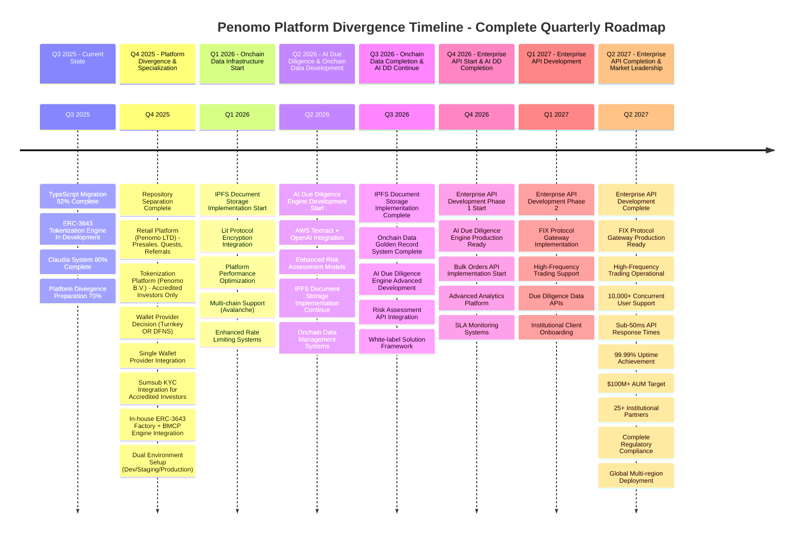
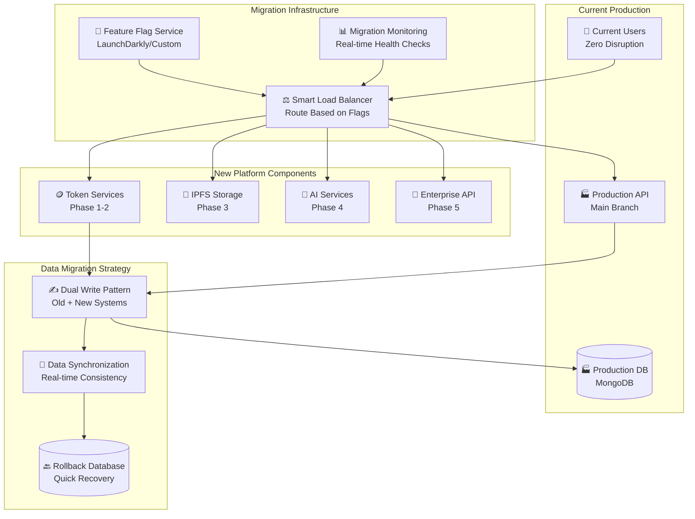
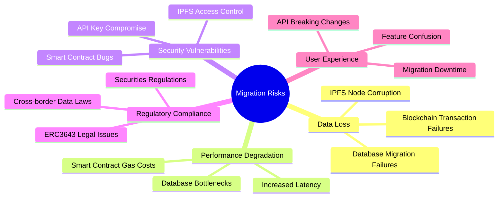
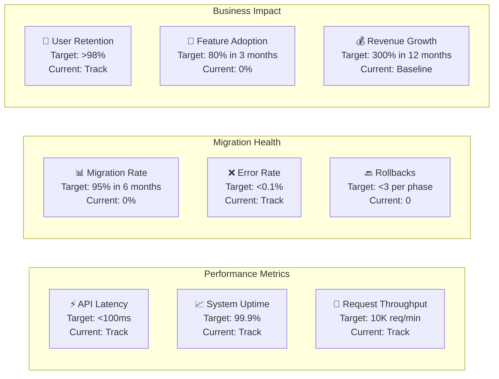
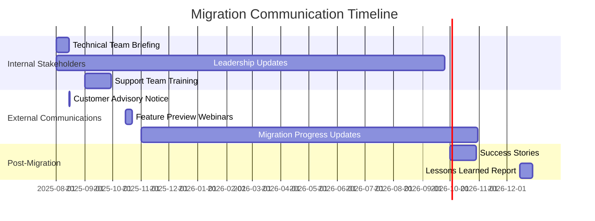

# Penomo Platform Divergence & Development Roadmap

## Executive Summary

This roadmap outlines the strategic divergence of the Penomo codebase into two distinct platforms:
1. **Penomo Retail Platform (Penomo LTD)** - Focused on retail investors with presales, quests, and referrals
2. **Penomo Tokenization Platform (Penomo B.V.)** - Enterprise-grade tokenization for accredited investors only

The divergence follows a phased approach ensuring clear separation of concerns while maintaining operational continuity.

**Current Status (September 2025)**: Platform divergence preparation 70% complete with substantial TypeScript migration progress. Codebase analysis shows 653 TypeScript files vs 145 JavaScript files (82% migration complete). ERC-3643 tokenization engine in development with 37 TypeScript files and testing framework. Claudia system 80% complete with comprehensive automation capabilities.

### Q3 2025 Development Achievements (Codebase Analysis)

- ✅ **TypeScript Migration**: 82% complete (653 TS files vs 145 JS files in API layer)
- 🔄 **ERC-3643 Smart Contracts**: Implementation in progress with 37 TypeScript files and testing suite
- ✅ **Modern Development Stack**: TSX runtime, ES modules, Jest testing framework with 70% coverage target
- ✅ **API Modernization**: Full TypeScript configuration, express-validator integration, MongoDB with Mongoose
- ✅ **Claudia Project Management**: 80% completion with comprehensive sprint-based automation
- ✅ **Development Infrastructure**: Complete transition to modern tooling (TypeScript 5.9+, Node.js 18.17+)

## Development Automation Strategy: Claudia System Enhancement

### Vision: Mandatory Development Ecosystem
Transform Claudia from project management tool into a comprehensive, mandatory development ecosystem that enforces traceable workflows, automates quality gates, and provides complete architectural evolution tracking.

> 📋 **PLANNING DOCUMENTS RULE**: All roadmap items must reference their corresponding planning documents in `.claude-shared/project-management/2-planning/`. See [250913-03-claudia-system-enhancement-comprehensive-development-ecosystem.md](../.claude-shared/project-management/2-planning/250913-03-claudia-system-enhancement-comprehensive-development-ecosystem.md) for the complete Claudia enhancement planning document.

### Strategic Objectives
- **GitHub-First Approach**: Migrate to GitHub-only project management (eliminate Notion dependency)
- **Mandatory Workflow Enforcement**: Make it impossible to commit, create PRs, or merge without Claudia commands
- **Complete Traceability**: Link all planning docs, requirements, sprints, tickets with commit hashes
- **Interactive Code Reviews**: Structured, trackable code review process with quality metrics
- **Environment Management**: Automated environment control and branch-to-environment mapping
- **Security Integration**: Penetration testing templates for API routes with automated scanning
- **Agent Integration**: Hybrid human-AI development workflows with workload balancing
- **Comprehensive KPI Reporting**: Real-time dashboards with architectural evolution tracking

### Implementation Phases

#### Phase 1: Mandatory Workflow Foundation ⚡ **CRITICAL PRIORITY**
**Focus: GitHub Migration & Workflow Enforcement**

**Foundation Phase:**
- Migration from Notion to GitHub Projects for sprint management
- Export existing project data to GitHub Issues with audit trail preservation
- Configure GitHub Discussions for team collaboration
- Create automated migration scripts

**Enforcement Phase:**
- Configure branch protection rules across all repositories
- Implement pre-commit hooks with Claudia validation
- Set up GitHub Actions for mandatory workflow enforcement
- Create emergency bypass procedures for critical situations

**Validation Phase:**
- End-to-end workflow testing with enforcement enabled
- Validate branch protection and pre-commit hook functionality
- Ensure all existing Claudia commands work with new enforcement
- Document comprehensive enforcement bypass procedures

**Deliverables:**
- GitHub-only project management system
- Branch protection with mandatory Claudia workflows
- Pre-commit hooks preventing non-Claudia commits
- Complete migration from Notion to GitHub

#### Phase 2: Enhanced Development Commands 🔧 **HIGH PRIORITY**
**Focus: Interactive Reviews & Environment Management**

**Interactive Code Review System:**
```bash
/claudia:review:start <pr-number>      # Initialize review session
/claudia:review:analyze <pr-number>    # Automated code analysis
/claudia:review:interactive <pr-number> # Structured review process
```
- Automated code analysis integration (complexity, security, performance)
- Structured review templates and commenting system
- Review metrics tracking and quality scoring
- Integration with GitHub PR review system

**Environment Management System:**
```bash
/claudia:env:create <env-name>         # Create new environment
/claudia:env:link <branch> <env>       # Link branch to environment
/claudia:env:deploy <branch> <env>     # Deploy to specific environment
/claudia:env:status                    # Show all environment statuses
```
- Environment lifecycle management with automated controls
- Branch-to-environment linking system
- Automated deployment with environment-specific configurations
- Real-time environment status monitoring

**Security Testing Integration:**
```bash
/claudia:security:pentest:create <route>  # Create pentest template
/claudia:security:pentest:run <template>  # Run security tests
/claudia:security:pentest:report <run-id> # Generate security reports
```
- API route penetration testing templates
- Automated security scanning integration (OWASP ZAP)
- Security report generation and tracking
- Integration with development workflow

**Deliverables:**
- Interactive code review system with metrics
- Complete environment management automation
- Security testing integrated into development workflow
- Automated quality gates and reporting

#### Phase 3: Advanced Analytics & Agent Integration 🤖 **MEDIUM PRIORITY**
**Focus: KPI System & Human-AI Collaboration**

**Comprehensive KPI Reporting System:**
```bash
/claudia:kpi:dashboard                 # Real-time KPI dashboard
/claudia:kpi:architecture              # Architectural evolution tracking
/claudia:kpi:trends <metric>           # Trend analysis
/claudia:kpi:predictions <sprint>      # Predictive analytics
```
- Real-time KPI dashboard with architectural traceability
- Trend analysis and predictive analytics for sprint planning
- Export capabilities for stakeholder reports
- Integration with commit hash tracking for living architecture docs

**Developer & Agent Assignment System:**
```bash
/claudia:assign:developer <ticket> <user>    # Human developer assignment
/claudia:assign:agent <ticket> <agent>       # AI agent assignment
/claudia:assign:hybrid <ticket> <dev> <agent> # Pair programming setup
/claudia:assign:auto <ticket>                # Auto-assignment based on workload
```
- GitHub issue assignment with agent integration
- Workload balancing and capacity management across human and AI resources
- Hybrid human-AI development workflow support
- Automated assignment based on expertise and availability

**Integration & Testing:**
- Complete system integration testing across all components
- Performance optimization for enterprise-scale repositories
- Security audit of all new components and integrations
- Comprehensive documentation and training material creation

**Deliverables:**
- Real-time KPI dashboard with predictive analytics
- Human-AI hybrid development workflow system
- Complete system integration with performance optimization
- Comprehensive training and documentation

#### Phase 4: Advanced Automation 🚀 **LOW PRIORITY**
**Focus: Intelligence & Optimization**

**Advanced Workflow Automation:**
- Smart workflow suggestions based on project patterns and history
- Automated dependency detection and management across repositories
- Advanced error recovery and rollback procedures
- Intelligent resource allocation and optimization

**Performance Optimization & Monitoring:**
- System performance monitoring with real-time alerting
- Advanced caching for large enterprise repositories
- Real-time system health monitoring and alerting
- Automated performance optimization recommendations

**Deliverables:**
- Intelligent workflow automation with pattern recognition
- Enterprise-scale performance optimization
- Advanced monitoring and alerting system
- Complete automation intelligence platform

### Technical Implementation Strategy

**Core Technology Stack:**
- **Backend:** Node.js/TypeScript for Claudia command system
- **GitHub Integration:** Octokit.js for comprehensive GitHub API access
- **Analytics Dashboard:** Chart.js + D3.js for real-time visualizations
- **Security Testing:** OWASP ZAP integration with custom API testing frameworks
- **Infrastructure:** GitHub Actions for CI/CD automation and workflow enforcement
- **Documentation:** Automated markdown generation from commit data and architecture evolution

**Resource Requirements:**
- **Senior Development Team:** GitHub API expertise, TypeScript proficiency, automation experience
- **DevOps Specialist:** Environment automation, deployment pipeline expertise
- **Security Expert:** Penetration testing, security automation, compliance knowledge
- **Project Coordinator:** Migration planning, stakeholder communication, training facilitation

**Risk Mitigation Strategy:**
- **Gradual Rollout:** Feature flags for each phase with controlled deployment
- **Parallel Systems:** Maintain existing workflows during migration periods
- **Emergency Procedures:** Comprehensive bypass procedures for critical hotfixes
- **Testing Strategy:** Isolated environment testing before production deployment

**Success Metrics:**
- **Workflow Compliance:** 100% mandatory Claudia command usage
- **Quality Improvement:** >25% reduction in bugs through automated quality gates
- **Developer Productivity:** >30% increase in development velocity
- **Security Enhancement:** >90% automated security test coverage
- **Architectural Traceability:** Complete commit-to-requirement tracking
- **Agent Integration Success:** >50% of tickets successfully completed with AI assistance

### Feasibility Assessment: HIGHLY FEASIBLE

**Immediate Implementation (Phase 1):**
- ✅ GitHub APIs are mature and well-documented
- ✅ Branch protection is native GitHub functionality with excellent API support
- ✅ Pre-commit hooks are standard development practice with proven implementations

**Standard Implementation (Phase 2):**
- ✅ Interactive code review system leverages GitHub PR API + existing analysis tools
- ✅ Environment management uses Infrastructure as Code + GitHub Actions integration
- ✅ Security testing with OWASP ZAP has extensive documentation and community support

**Advanced Implementation (Phase 3):**
- ✅ KPI reporting system uses GitHub API data + established analytics frameworks
- ✅ Agent assignment system builds on GitHub webhooks and API integrations
- ✅ Architectural traceability uses git log analysis + commit hash cross-referencing

This comprehensive enhancement transforms Claudia into a mandatory development ecosystem that ensures complete traceability, automated quality gates, and data-driven development insights while supporting hybrid human-AI development workflows.

## Platform Divergence Strategy

> 📋 **PLANNING REFERENCES**: See related planning documents:
> - [250912-02-codebase-divergence-platform-separation.md](../.claude-shared/project-management/2-planning/250912-02-codebase-divergence-platform-separation.md) - Platform separation strategy
> - [250912-04-turnkey-wallet-integration-accredited-investors.md](../.claude-shared/project-management/2-planning/250912-04-turnkey-wallet-integration-accredited-investors.md) - Wallet integration planning
> - [250912-05-dfns-wallet-integration-accredited-investors.md](../.claude-shared/project-management/2-planning/250912-05-dfns-wallet-integration-accredited-investors.md) - DFNS wallet analysis
> - [250913-01-onchain-data-golden-record.md](../.claude-shared/project-management/2-planning/250913-01-onchain-data-golden-record.md) - On-chain data management
> - [250913-02-enterprise-api-institutional-features.md](../.claude-shared/project-management/2-planning/250913-02-enterprise-api-institutional-features.md) - Enterprise API planning



## Platform Divergence Architecture

```mermaid
flowchart TB
    subgraph "Current Unified Codebase"
        CURRENT[🏛️ Current Penomo API<br/>Mixed User Types<br/>All Features]
    end
    
    subgraph "Diverged Platforms"
        subgraph "Penomo Retail Platform (Penomo LTD)"
            RETAIL_API[🛍️ Retail API<br/>Presales, Quests, Referrals]
            RETAIL_INVEST[📱 Invest App (Retail)<br/>Retail Investors Only]
            RETAIL_ADMIN[⚙️ Admin App (Retail)<br/>Retail Management]
            RETAIL_WALLET[🔐 Web3Auth Only]
        end
        
        subgraph "Penomo Tokenization Platform (Penomo B.V.)"
            TOKEN_API[🏦 Tokenization API<br/>ERC3643, BMCP Integration]
            TOKEN_INVEST[📊 Invest App (Accredited)<br/>Accredited Investors Only]
            TOKEN_RAISE[🏢 Raise App<br/>Token Issuance]
            TOKEN_ADMIN[⚙️ Admin App (Tokenization)<br/>Token Management]
            TOKEN_WALLET[🔒 Turnkey/DFNS Wallets]
            SUMSUB_KYC[📋 Sumsub KYC<br/>Accredited Verification]
        end
    end
    
    subgraph "Deployment Environments"
        RETAIL_ENV[🛍️ Retail Environments<br/>Staging + Production]
        TOKEN_ENV[🏦 Tokenization Environments<br/>Staging + Production]
    end
    
    CURRENT --> RETAIL_API
    CURRENT --> TOKEN_API
    
    RETAIL_API --> RETAIL_INVEST
    RETAIL_API --> RETAIL_ADMIN
    RETAIL_API --> RETAIL_WALLET
    
    TOKEN_API --> TOKEN_INVEST
    TOKEN_API --> TOKEN_RAISE
    TOKEN_API --> TOKEN_ADMIN
    TOKEN_API --> TOKEN_WALLET
    TOKEN_API --> SUMSUB_KYC
    
    RETAIL_API --> RETAIL_ENV
    TOKEN_API --> TOKEN_ENV
```

## Phase-by-Phase Migration Plan

### Q4 2025: Platform Divergence & Core Infrastructure 
**Status**: 🔄 Implementation Phase
**Timeline**: Q4 2025 (October - December 2025)
**Divergence Strategy**: Complete platform separation with specialized focus

**Critical Tasks:**
1. **Repository Separation** (Week 1-2)
   - Create new repositories for tokenization platform
   - Copy existing codebase (invest app, raise app, admin app, backend)
   - Set up separate deployment pipelines
   - Establish independent versioning and release cycles

2. **Retail Platform Focus** (Week 3-4)
   - Remove tokenization-related code from retail platform
   - Remove accredited investor profiles and features
   - Focus on presales, quests, and referrals functionality
   - Maintain Web3Auth as sole authentication method

3. **Tokenization Platform Specialization** (Week 5-6)
   - Remove retail features (quests, referrals, presales)
   - Restrict to accredited investors only
   - Integrate Turnkey and DFNS wallet providers
   - Integrate Sumsub for accredited investor KYC

4. **Dual Environment Setup** (Week 7-8)
   - Set up staging and production for both platforms
   - Configure separate monitoring and logging
   - Establish platform-specific CI/CD pipelines
   - User acceptance testing for both platforms

### Q1 2026: Advanced Infrastructure & AI Integration
**Timeline**: Q1 2026 (January - March 2026)  
**Focus**: IPFS Storage, AI Due Diligence, Performance Optimization

**Key Components:**
- **ERC3643 Onchain Factory Integration**: Direct ERC3643 token deployment for tokenization platform
- **BMCP Integration**: Blackmanta Capital Partners tokenization engine
- **Accredited Investor Focus**: Tokenization available only to accredited investors
- **Smart Contract Management**: Automated deployment, configuration, and monitoring
- **Token Lifecycle Management**: Minting, burning, transfer, and compliance controls
- **Regulatory Compliance**: Built-in ERC3643 compliance features

**Implementation Strategy:**
- **Parallel Development**: Both in-house and BMCP engines in October 2025
- **Accredited Only**: No tokenization features in retail platform
- **Enhanced Control**: Full ownership and control of tokenization infrastructure

### Q2 2026: Enterprise API Development Phase 1
**Timeline**: Q2 2026 (April - June 2026)
**Focus**: Core Enterprise Features, Multi-chain Support, API Infrastructure

**Key Components:**
- **Single Wallet Provider Decision**: Choose between Turnkey (performance-focused) OR DFNS (compliance-focused) - not both
  - **Turnkey Option**: High-performance wallet provider optimized for speed and efficiency
  - **DFNS Option**: Compliance-focused wallet provider with regulatory features
  - **Decision Required**: Final selection must be made before October 2025 implementation
- **Web3Auth Removal**: No Web3Auth on tokenization platform
- **Sumsub KYC Integration**: Accredited investor verification system
  - Integration with Sumsub KYC provider
  - Accredited investor status verification (requirements TBD)
  - Integration with tokenization platform user onboarding
  - Compliance documentation and reporting

**Implementation Strategy:**
- **Platform Separation**: Different wallet providers for different platforms
- **Single Wallet Provider**: Final decision between Turnkey OR DFNS (mutual exclusive choice)
- **Decision Criteria**: Evaluate based on performance requirements vs. compliance requirements
- **Accredited Focus**: Enterprise-grade solutions for accredited investors
- **Mandatory KYC**: All tokenization platform users must complete Sumsub verification
- **Compliance First**: Regulatory-compliant wallet and KYC solutions
- **Automated Verification**: Seamless integration between Sumsub KYC and chosen wallet provider
- **Compliance Integration**: Basic KYC verification for accredited investor onboarding

### Q3 2026: Enterprise API Completion & Trading Systems
**Timeline**: Q3 2026 (July - September 2026)
**Focus**: FIX Protocol, High-Frequency Trading, White-label Solutions

**Migration Strategy:**
- **Hybrid Approach**: Maintain AWS S3 + IPFS during transition
- **Document Migration**: Batch transfer of existing documents
- **Enhanced Privacy**: Lit Protocol encryption for sensitive data

### Q4 2026: Market Leadership & Scale Achievement
**Timeline**: Q4 2026 (October - December 2026)
**Focus**: Production Scale, SLA Achievement, Global Deployment

**Migration Approach:**
- **Shadow Mode**: Run AI analysis alongside human review
- **Gradual Adoption**: Start with risk scoring, expand to full DD
- **Human Oversight**: Maintain manual review capabilities

**Key Deliverables:**
- **Performance Targets**: 99.99% uptime, sub-50ms API response times
- **Scale Achievement**: 10,000+ concurrent users, $100M+ AUM
- **Global Deployment**: Multi-region infrastructure with full compliance
- **Institutional Readiness**: 25+ institutional partners, complete regulatory framework

## Technical Migration Architecture



## Risk Management & Contingency Plans

### High-Risk Migration Points



### Mitigation Strategies

**Data Protection:**
- **Real-time Backups**: Continuous data replication
- **Dual-write Pattern**: Write to both old and new systems
- **Rollback Windows**: 48-hour easy reversion capability

**Performance Monitoring:**
- **SLA Targets**: 99.9% uptime, <100ms API response
- **Auto-scaling**: Dynamic resource allocation
- **Circuit Breakers**: Automatic failover mechanisms

**Security Measures:**
- **Smart Contract Audits**: Multiple security firms
- **Penetration Testing**: Quarterly security assessments
- **Zero-trust Architecture**: Comprehensive access controls

## Success Metrics & KPIs

### Technical KPIs



### Quarterly Business KPIs

**Q3 2025 Targets (Current State):**
- ✅ TypeScript Migration: 82% complete (653 TS / 145 JS files)
- 🔄 ERC-3643 Engine: In development with comprehensive testing framework
- ✅ Claudia System: 80% automation coverage with sprint-based workflows
- 🎯 Platform Divergence: 100% preparation complete for Q4 implementation

**Q4 2025 Targets (Platform Divergence):**
- 🎯 Repository Separation: Complete dual-platform architecture
- 🎯 Wallet Provider Integration: Single enterprise provider operational
- 🎯 KYC Integration: Sumsub operational for accredited investor verification  
- 🎯 Tokenization Engine: In-house ERC-3643 + BMCP dual engine architecture

**Q1 2026 Targets (Onchain Data Infrastructure Start):**
- 🎯 IPFS Storage: Implementation started with foundational architecture
- 🎯 Onchain Data Systems: Infrastructure development initiated
- 🎯 Performance Optimization: <100ms API response times, 99.9% uptime
- 🎯 Multi-chain Support: Avalanche integration operational

**Q2 2026 Targets (AI DD Start & Onchain Data Development):**
- 🎯 AI Due Diligence: Engine development started with AWS Textract integration
- 🎯 Risk Assessment Models: Initial ML models deployed
- 🎯 IPFS Storage: 50% implementation progress
- 🎯 Onchain Data Management: Core systems development

**Q3 2026 Targets (Onchain Data Complete & AI DD Advanced):**
- 🎯 IPFS Storage: 100% document migration to decentralized storage complete
- 🎯 Onchain Data Golden Record: System operational and complete
- 🎯 AI Due Diligence: 75% accuracy in automated risk assessment
- 🎯 White-label Solutions: Framework ready for institutional partners

**Q4 2026 Targets (Enterprise API Start & AI DD Complete):**
- 🎯 Enterprise API: Phase 1 development started
- 🎯 AI Due Diligence: 90% accuracy achieved, production ready
- 🎯 Bulk Operations: API implementation initiated
- 🎯 Advanced Analytics: Platform operational

**Q1 2027 Targets (Enterprise API Development):**
- 🎯 Enterprise API: Phase 2 development with FIX Protocol
- 🎯 High-Frequency Trading: Support implementation
- 🎯 Due Diligence Data APIs: Institutional integration complete
- 🎯 Institutional Onboarding: Streamlined client acquisition

**Q2 2027 Targets (Enterprise API Complete & Market Leadership):**
- 🎯 Enterprise API: Complete implementation operational
- 🎯 Scale Achievement: 10,000+ concurrent users, $100M+ AUM
- 🎯 Performance Excellence: 99.99% uptime, sub-50ms API responses
- 🎯 Global Presence: Multi-region deployment with full compliance
- 🎯 Institutional Adoption: 25+ institutional partners, $10M+ ARR

## Communication & Change Management

### Stakeholder Communication Plan



**Key Messages:**
- **Zero Disruption**: Existing features remain fully functional
- **Enhanced Capabilities**: New features unlock greater investment potential
- **Future-Ready**: Platform positioned for institutional adoption
- **Competitive Advantage**: Industry-leading tokenization capabilities

## Conclusion

This comprehensive migration roadmap ensures Penomo's evolution from a basic investment platform to the leading institutional-grade tokenization ecosystem. The phased approach minimizes risk while maximizing business value, positioning Penomo as the definitive platform for tokenized securities.

**Key Success Factors:**
1. **Rigorous Testing**: Comprehensive validation at each phase
2. **Gradual Rollout**: Feature flags enable controlled deployment
3. **Continuous Monitoring**: Real-time health checks and performance tracking
4. **Stakeholder Communication**: Transparent progress updates and support
5. **Risk Mitigation**: Multiple contingency plans for critical failure points

**Expected Outcomes by Q2 2027:**
- 🎯 **Technical Excellence**: 99.99% uptime, sub-50ms response times, zero critical vulnerabilities
- 🎯 **Business Growth**: 300% revenue increase, 25+ institutional partners, $10M+ ARR
- 🎯 **Market Leadership**: Industry-leading dual tokenization engine capabilities
- 🎯 **User Satisfaction**: >98% user retention through migration
- 🎯 **Platform Maturity**: Production-ready tokenization with enterprise-grade security
- 🎯 **Scale Achievement**: 10,000+ concurrent users, $100M+ AUM
- 🎯 **Global Deployment**: Multi-region infrastructure with complete regulatory compliance
- 🎯 **Enterprise API**: Complete institutional trading platform with FIX Protocol
- 🎯 **AI Due Diligence**: Production-ready automated risk assessment (90%+ accuracy)
- 🎯 **Onchain Data**: Complete IPFS-based golden record system

**Total Timeline: Q3 2025 - Q2 2027 (8 Quarters)**

The roadmap positions Penomo as the definitive institutional-grade tokenization platform while ensuring zero disruption to existing operations and maintaining the reliability that users depend on.