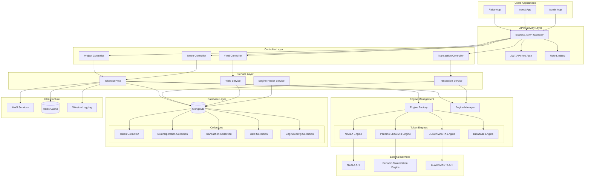
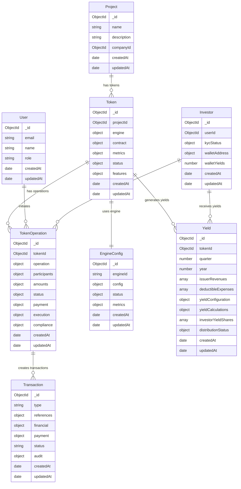
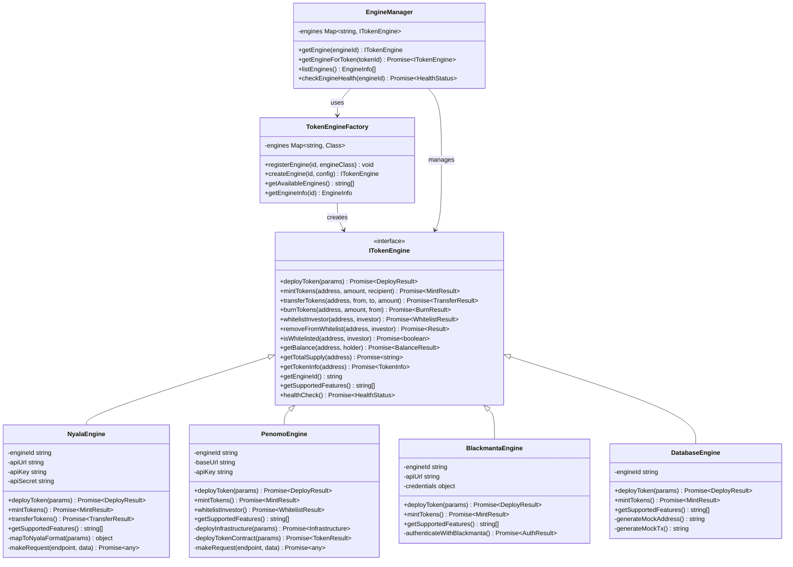
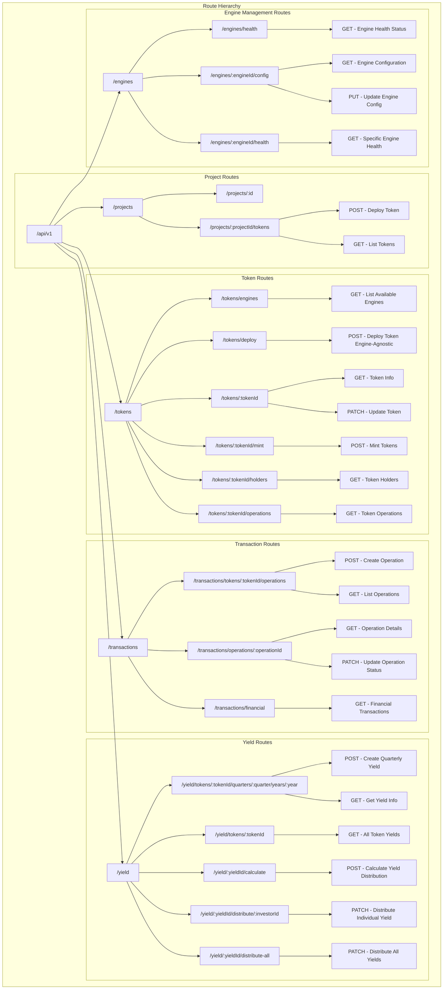
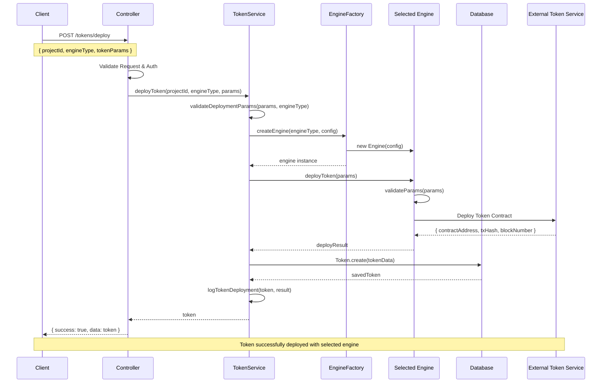
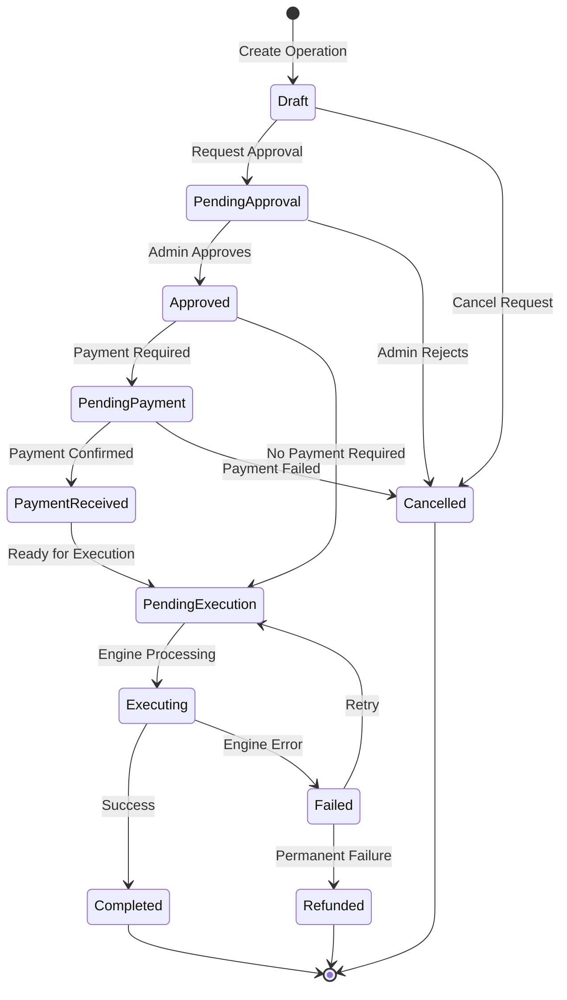
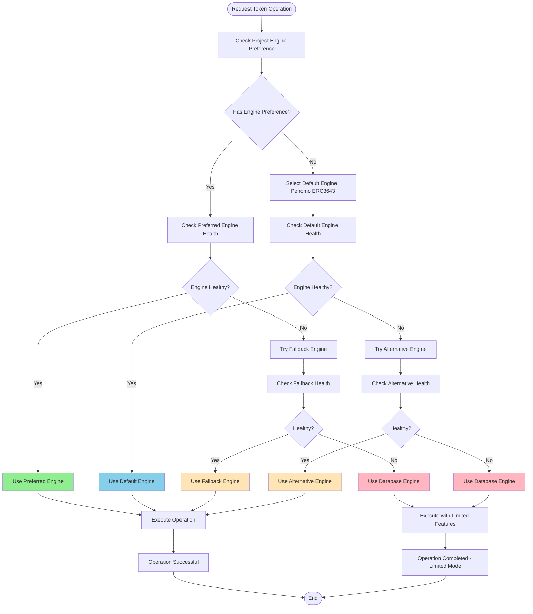
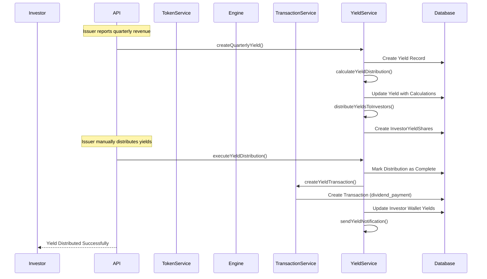
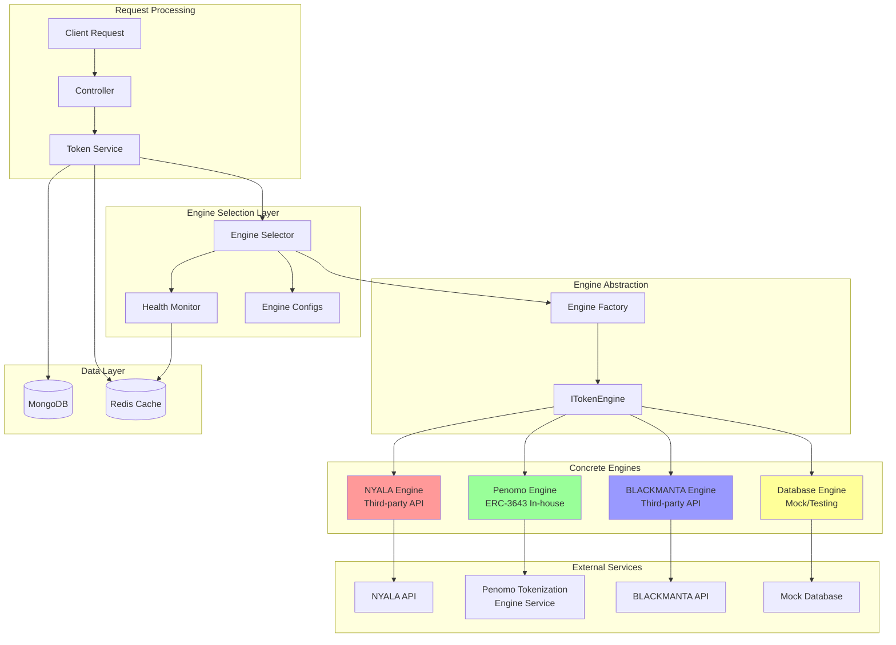
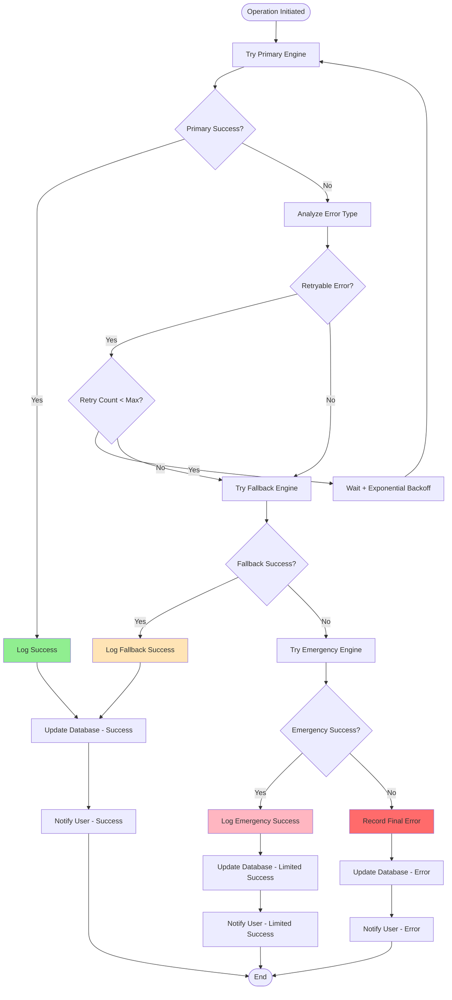

# Tokenization System - Pragmatic Refactoring Plan

**Author:** Sascha Kubisch  
**Date:** August 11, 2025  
**Status:** Planning Phase - Constrained Scope  
**Type:** Technical Refactoring Plan  

## Executive Summary

Pragmatic refactoring of the tokenization system to support multiple engines while **keeping most of the existing codebase intact**. Only refactoring specific models (`token`, `tokenTransfer`, `transaction`, `revenue`) and routes (`revenue`, `transaction`, `project`) to minimize disruption.

**Key Addition**: Complete Revenue → Yield system refactoring to support configurable yield distribution models for tokenized renewable energy bonds.

## Refactoring Constraints

### What We CAN Change
- **Models**: `token.model.js`, `tokenTransfer.model.js`, `transaction.model.js`, `revenue.model.js`
- **Routes**: `revenue.routes.js`, `transaction.routes.js`, `project.routes.js`
- **Services**: `revenues.service.js`
- **New Additions**: Can add new models, services, and routes
- **Revenue → Yield Renaming**: Complete system renaming from "revenue" to "yield"

### What We MUST Keep
- All other existing models (User, Company, Investor, etc.)
- All other existing routes and controllers
- Existing service architecture
- Current authentication system
- Existing middleware

## Database Model Refactoring

### 1. Token Model (Refactored)

**Current**: 12+ NYALA-specific fields with complex state tracking

**New Design**: Engine-agnostic with clean separation

```javascript
// api/models/token.model.js
const tokenSchema = new Schema({
  // Core References (unchanged)
  projectId: {
    type: mongoose.Schema.Types.ObjectId,
    ref: 'Project',
    required: true
  },
  
  // Engine Configuration (NEW)
  engine: {
    type: {
      type: String,
      enum: ['inhouse_erc3643', 'bmcp', 'tokeny', 'nyala', 'testengine'],
      required: true
    },
    config: {
      type: Schema.Types.Mixed,  // Engine-specific configuration
      default: {}
    },
    metadata: {
      type: Schema.Types.Mixed,  // Engine-specific data (replaces nyala fields)
      default: {}
    }
  },
  
  // Universal Token Properties (simplified)
  contract: {
    address: { type: String, required: true, unique: true },
    symbol: { type: String, required: true },
    name: { type: String, required: true },
    decimals: { type: Number, default: 18 },
    network: { type: String, default: 'polygon' }
  },
  
  // Business Metrics (unchanged)
  metrics: {
    totalSupply: { type: String, default: '0' },
    circulatingSupply: { type: String, default: '0' },
    tokensSold: { type: Number, default: 0 },
    holdersCount: { type: Number, default: 0 }
  },
  
  // Status Management (simplified from 10+ booleans)
  status: {
    deployment: {
      type: String,
      enum: ['pending', 'deploying', 'deployed', 'failed'],
      default: 'pending'
    },
    operational: {
      type: String,
      enum: ['active', 'paused', 'frozen'],
      default: 'active'
    }
  },
  
  // Compliance & Features
  features: {
    transferRestrictions: { type: Boolean, default: true },
    whitelistRequired: { type: Boolean, default: true },
    complianceEnabled: { type: Boolean, default: true }
  }
}, {
  timestamps: true
})

// Indexes
tokenSchema.index({ projectId: 1 })
tokenSchema.index({ 'contract.address': 1 })
tokenSchema.index({ 'engine.type': 1 })
```

### 2. TokenTransfer Model (Refactored)

**Current**: 25+ boolean flags for complex state machine

**New Design**: Event-driven operation model

```javascript
// api/models/tokenOperation.model.js (replaces tokenTransfer)
const tokenOperationSchema = new Schema({
  // Token Reference
  tokenId: {
    type: mongoose.Schema.Types.ObjectId,
    ref: 'Token',
    required: true
  },
  
  // Operation Type (replaces multiple boolean flags)
  operation: {
    type: {
      type: String,
      enum: ['purchase', 'mint', 'transfer', 'redeem', 'freeze', 'unfreeze'],
      required: true
    },
    subtype: {
      type: String,  // e.g., 'primary_sale', 'secondary_market', etc.
    }
  },
  
  // Participants
  participants: {
    initiator: {
      type: mongoose.Schema.Types.ObjectId,
      ref: 'User',
      required: true
    },
    investor: {
      type: mongoose.Schema.Types.ObjectId,
      ref: 'Investor'
    },
    fromAddress: String,
    toAddress: String
  },
  
  // Amounts
  amounts: {
    requested: { type: String, required: true },
    approved: String,
    executed: String,
    currency: { type: String, default: 'USD' }
  },
  
  // Single Status Field (replaces 25+ booleans)
  status: {
    current: {
      type: String,
      enum: [
        'draft',
        'pending_approval',
        'approved',
        'pending_payment',
        'payment_received',
        'pending_execution',
        'executing',
        'completed',
        'failed',
        'cancelled',
        'refunded'
      ],
      required: true,
      default: 'draft'
    },
    history: [{
      status: String,
      timestamp: Date,
      reason: String,
      updatedBy: { type: mongoose.Schema.Types.ObjectId, ref: 'User' }
    }]
  },
  
  // Payment Information (simplified)
  payment: {
    method: {
      type: String,
      enum: ['wire', 'ach', 'crypto', 'credit_card'],
    },
    reference: String,
    receivedAt: Date,
    amount: String,
    currency: String
  },
  
  // Blockchain/Engine Data
  execution: {
    engineType: String,
    transactionHash: String,
    blockNumber: Number,
    gasUsed: String,
    confirmedAt: Date,
    engineResponse: Schema.Types.Mixed
  },
  
  // Compliance
  compliance: {
    kycVerified: { type: Boolean, default: false },
    amlChecked: { type: Boolean, default: false },
    accreditationVerified: { type: Boolean, default: false },
    whitelisted: { type: Boolean, default: false }
  }
}, {
  timestamps: true
})

// Indexes
tokenOperationSchema.index({ tokenId: 1, 'status.current': 1 })
tokenOperationSchema.index({ 'participants.investor': 1 })
tokenOperationSchema.index({ 'execution.transactionHash': 1 })
```

### 3. Transaction Model (Refactored)

**Current**: Mixed concerns between payments and token operations

**New Design**: Clean financial transaction tracking

```javascript
// api/models/transaction.model.js
const transactionSchema = new Schema({
  // Type of Transaction
  type: {
    type: String,
    enum: [
      'token_purchase',    // Investor buys tokens
      'token_sale',        // Investor sells tokens
      'yield_payment',     // Yield distribution (covers interest, revenue share, mixed)
      'interest_payment',  // Fixed interest component of yield
      'revenue_share',     // Revenue share component of yield
      'dividend_payment',  // Traditional dividend distribution
      'fee_collection',    // Platform fees
      'refund'            // Refund to investor
    ],
    required: true
  },
  
  // Related Entities
  references: {
    projectId: { type: mongoose.Schema.Types.ObjectId, ref: 'Project' },
    tokenId: { type: mongoose.Schema.Types.ObjectId, ref: 'Token' },
    operationId: { type: mongoose.Schema.Types.ObjectId, ref: 'TokenOperation' },
    investorId: { type: mongoose.Schema.Types.ObjectId, ref: 'Investor' }
  },
  
  // Financial Details
  financial: {
    amount: { type: Number, required: true },
    currency: { type: String, default: 'USD' },
    exchangeRate: Number,
    fees: {
      platform: { type: Number, default: 0 },
      network: { type: Number, default: 0 },
      total: { type: Number, default: 0 }
    }
  },
  
  // Payment Method
  payment: {
    method: {
      type: String,
      enum: ['wire', 'ach', 'crypto', 'credit_card', 'internal'],
      required: true
    },
    processor: String,  // Stripe, bank name, etc.
    reference: String,   // External transaction ID
    metadata: Schema.Types.Mixed
  },
  
  // Status
  status: {
    type: String,
    enum: ['pending', 'processing', 'completed', 'failed', 'reversed'],
    default: 'pending'
  },
  
  // Audit Trail
  audit: {
    createdBy: { type: mongoose.Schema.Types.ObjectId, ref: 'User' },
    approvedBy: { type: mongoose.Schema.Types.ObjectId, ref: 'User' },
    approvedAt: Date,
    notes: String
  }
}, {
  timestamps: true
})

// Indexes
transactionSchema.index({ 'references.projectId': 1, type: 1 })
transactionSchema.index({ 'references.investorId': 1 })
transactionSchema.index({ status: 1, createdAt: -1 })
```

### 4. New Engine Configuration Model

```javascript
// api/models/engineConfig.model.js (NEW)
const engineConfigSchema = new Schema({
  // Engine Identification
  engineId: {
    type: String,
    enum: ['nyala', 'blockchain', 'database'],
    required: true,
    unique: true
  },
  
  // Configuration
  config: {
    apiUrl: String,
    apiKey: { type: String, select: false },
    // Production: Use AWS Secrets Manager or HashiCorp Vault - DO NOT store in DB
    apiSecret: { type: String, select: false }, // DEV ONLY - use external secret management
    network: String,
    contractAddresses: {
      factory: String,
      registry: String,
      compliance: String
    },
    features: [String]  // Supported capabilities
  },
  
  // Status
  status: {
    active: { type: Boolean, default: true },
    healthCheck: {
      lastChecked: Date,
      isHealthy: Boolean,
      error: String
    }
  },
  
  // Usage Metrics
  metrics: {
    totalDeployments: { type: Number, default: 0 },
    totalTransactions: { type: Number, default: 0 },
    lastUsed: Date
  }
}, {
  timestamps: true
})
```

## Engine Prioritization & Compatibility Strategy

### **CRITICAL DECISION: Engine Prioritization**

**PRODUCTION PRIORITY ENGINES:**

**TIER 1 - PRIMARY PRODUCTION ENGINES:**
- **InHouse ERC-3643**: Our in-house ERC-3643 factory-based tokenization engine
- **BMCP**: BlackManta Capital Partners tokenization engine (implementation unknown)
- **Tokeny**: T-REX/ERC-3643 based tokenization platform

**TIER 2 - BACKUP ENGINE:**
- **NYALA**: Maintained as backup implementation, not low priority but secondary to production engines

**DEVELOPMENT & TESTING:**
- **TestEngine**: Mock engine for development and testing workflows

### **Production Engine Details:**

**InHouse ERC-3643 Engine:**
- All core features designed around ERC-3643 factory contract capabilities
- Direct blockchain interaction with pre-deployed compliance infrastructure
- On-chain compliance management and full transparency
- Factory-based token deployment for standardized ERC-3643 compliance

**BMCP Engine:**
- BlackManta Capital Partners tokenization engine
- Implementation details unknown - requires research and integration
- Will follow ERC-3643 compatibility patterns

**Tokeny Engine:**
- T-REX protocol implementation (ERC-3643 standard)
- Established tokenization platform with proven compliance features
- Will require API integration research

**NYALA Engine (Backup):**
- Maintained as reliable backup option
- Uses our KYC data as source of truth, submits to NYALA when needed
- Maintains parallel investor records for compatibility
- **NOT low priority** - critical backup for production reliability

### ERC-3643 Factory Integration Architecture

Based on https://docs.erc3643.org/erc-3643/smart-contracts-library/tokens-factory research:

**Factory Contract Advantages:**
- Single transaction deploys fully compliant ERC-3643 tokens
- Pre-deployed infrastructure (Identity Registry, Compliance contracts)
- Standardized deployment process with built-in compliance
- Modular compliance system for different restriction types

```javascript
// api/engines/InHouseERC3643Engine.js
class InHouseERC3643Engine extends ITokenizationEngine {
  constructor(config) {
    super()
    this.factoryAddress = config.tokenFactoryAddress
    this.web3 = new Web3(config.rpcUrl)
    this.factoryContract = new this.web3.eth.Contract(TOKEN_FACTORY_ABI, this.factoryAddress)
    this.identityRegistry = config.identityRegistryAddress
    this.complianceContract = config.complianceAddress
  }

  async deployToken(params) {
    const {
      tokenName,
      tokenSymbol, 
      decimals = 18,
      tokenDetails,
      initialOwner = this.deployerAddress
    } = params

    // Single factory call deploys ERC-3643 compliant token
    const tx = await this.factoryContract.methods.deployToken(
      this.identityRegistry,    // Pre-deployed identity registry
      this.complianceContract,  // Pre-deployed compliance contract
      tokenName,
      tokenSymbol,
      decimals,
      tokenDetails
    ).send({ 
      from: this.deployerAddress,
      gas: 5000000 // Factory deployment requires higher gas
    })

    const tokenAddress = tx.events.TokenDeployed.returnValues.token

    return {
      contractAddress: tokenAddress,
      deploymentTransaction: tx.transactionHash,
      blockNumber: tx.blockNumber,
      engineMetadata: {
        identityRegistry: this.identityRegistry,
        compliance: this.complianceContract,
        factoryAddress: this.factoryAddress,
        network: this.network,
        deploymentMethod: 'factory_contract'
      }
    }
  }

  async whitelistInvestor(tokenAddress, investorData) {
    // ERC-3643 requires investor identity registration
    const identityRegistry = new this.web3.eth.Contract(
      IDENTITY_REGISTRY_ABI, 
      this.identityRegistry
    )

    // Register investor identity on-chain with our KYC data
    const tx = await identityRegistry.methods.registerIdentity(
      investorData.walletAddress,
      investorData.onchainId,        // ONCHAINID identity
      investorData.countryCode       // Country for compliance
    ).send({ from: this.adminAddress })

    return {
      transactionHash: tx.transactionHash,
      identityRegistered: true,
      blockNumber: tx.blockNumber
    }
  }

  async mintTokens(tokenAddress, amount, recipient) {
    const token = new this.web3.eth.Contract(ERC3643_TOKEN_ABI, tokenAddress)
    
    // ERC-3643 mint with compliance checks
    const tx = await token.methods.mint(recipient, amount).send({
      from: this.adminAddress
    })

    return {
      transactionHash: tx.transactionHash,
      blockNumber: tx.blockNumber,
      amount,
      recipient,
      success: true
    }
  }

  async canTransfer(tokenAddress, from, to, amount) {
    const token = new this.web3.eth.Contract(ERC3643_TOKEN_ABI, tokenAddress)
    
    // Check ERC-3643 compliance before transfer
    return await token.methods.canTransfer(from, to, amount).call()
  }

  getEngineId() {
    return 'inhouse_erc3643'
  }

  getSupportedFeatures() {
    return [
      'deploy', 
      'mint', 
      'transfer', 
      'burn', 
      'whitelist', 
      'compliance_check',
      'identity_management',
      'transfer_restrictions'
    ]
  }
}
```

### Unified KYC Management Strategy

**Our Database = Source of Truth**
- All KYC data stored in our MongoDB first
- Parallel investor records maintained for engine compatibility
- KYC verification status managed internally

```javascript
// api/services/kyc.service.js
class KYCService {
  async processInvestorKYC(investorData) {
    // 1. Store in our DB (primary source of truth)
    const kycRecord = await KYC.create({
      investorId: investorData.investorId,
      documents: investorData.documents,
      personalInfo: investorData.personalInfo,
      walletAddress: investorData.walletAddress,
      onchainId: investorData.onchainId,
      countryCode: investorData.countryCode,
      verificationStatus: 'pending',
      verifiedAt: null
    })
    
    // 2. Prepare engine-specific data formats
    return {
      ourKYCId: kycRecord._id,
      erc3643Data: {
        walletAddress: investorData.walletAddress,
        onchainId: investorData.onchainId,
        countryCode: investorData.countryCode,
        identity: investorData.identity
      },
      nyalaData: {
        investorProfile: this.transformToNyalaFormat(kycRecord)
      }
    }
  }
  
  async submitToTokenizationEngine(engineType, tokenAddress, kycData) {
    const engine = engineManager.getEngine(engineType)
    
    switch(engineType) {
      case 'inhouse_erc3643':
        return await engine.whitelistInvestor(tokenAddress, kycData.erc3643Data)
      case 'nyala':
        return await engine.registerInvestor(kycData.nyalaData)
      case 'testengine':
        return { success: true, mock: true }
    }
  }

  transformToNyalaFormat(kycRecord) {
    // Transform our KYC format to NYALA's expected format
    return {
      firstName: kycRecord.personalInfo.firstName,
      lastName: kycRecord.personalInfo.lastName,
      email: kycRecord.personalInfo.email,
      nationality: kycRecord.countryCode,
      address: kycRecord.personalInfo.address,
      // ... other NYALA required fields
    }
  }
}
```

### Compliance Management Architecture

**ERC-3643 On-Chain Compliance (Primary)**
```javascript
// api/services/compliance.service.js
class ComplianceService {
  async setTransferRestrictions(tokenAddress, restrictions, engineType) {
    const engine = engineManager.getEngine(engineType)
    const normalizedRestrictions = this.normalizeRestrictions(restrictions, engineType)
    
    return await engine.setTransferRestrictions(tokenAddress, normalizedRestrictions)
  }

  async setERC3643Compliance(tokenAddress, restrictions) {
    const compliance = new this.web3.eth.Contract(
      ERC3643_COMPLIANCE_ABI, 
      await this.getComplianceAddress(tokenAddress)
    )
    
    const transactions = []
    
    // Set maximum investor count
    if (restrictions.maxInvestorCount) {
      transactions.push(
        compliance.methods.setMaxHolderCount(restrictions.maxInvestorCount)
      )
    }
    
    // Set country restrictions (whitelist/blacklist)
    if (restrictions.allowedCountries?.length) {
      transactions.push(
        compliance.methods.setCountryRestrictions(
          restrictions.allowedCountries,
          true // whitelist mode
        )
      )
    }
    
    // Set minimum holding period
    if (restrictions.minimumHoldingPeriod) {
      transactions.push(
        compliance.methods.setMinimumHoldingPeriod(restrictions.minimumHoldingPeriod)
      )
    }

    // Execute all compliance settings
    const results = await Promise.all(
      transactions.map(tx => tx.send({ from: this.adminAddress }))
    )

    return {
      success: true,
      transactions: results.map(r => r.transactionHash),
      restrictionsApplied: restrictions
    }
  }
  
  async canTransfer(tokenAddress, from, to, amount, engineType) {
    const engine = engineManager.getEngine(engineType)
    
    switch(engineType) {
      case 'inhouse_erc3643':
        return await engine.canTransfer(tokenAddress, from, to, amount)
      case 'nyala':
        return await engine.validateTransfer(tokenAddress, from, to, amount)
      default:
        return true // TestEngine allows all transfers
    }
  }

  normalizeRestrictions(restrictions, engineType) {
    switch(engineType) {
      case 'inhouse_erc3643':
        return {
          maxHolderCount: restrictions.maxInvestors,
          countryWhitelist: restrictions.allowedCountries,
          minimumHoldingPeriod: restrictions.lockupPeriodDays * 24 * 60 * 60, // Convert to seconds
          transferLimits: restrictions.transferLimits
        }
      case 'nyala':
        return {
          investorLimit: restrictions.maxInvestors,
          geographicRestrictions: restrictions.allowedCountries,
          lockupPeriod: restrictions.lockupPeriodDays
        }
      default:
        return restrictions
    }
  }
}
```

### Elegant Error Handling Solution

```javascript
// api/services/engineErrorHandler.service.js
class EngineErrorHandler {
  normalizeError(error, engineType, operation = 'unknown') {
    const baseError = {
      success: false,
      engineType,
      operation,
      timestamp: new Date(),
      originalError: error.message
    }
    
    switch(engineType) {
      case 'inhouse_erc3643':
        return this.handleBlockchainError(error, baseError)
      case 'nyala':
        return this.handleNyalaError(error, baseError)
      case 'testengine':
        return this.handleTestEngineError(error, baseError)
      default:
        return this.handleGenericError(error, baseError)
    }
  }
  
  handleBlockchainError(error, base) {
    // Smart contract revert errors
    if (error.message.includes('revert')) {
      const revertReason = this.extractRevertReason(error.message)
      return {
        ...base,
        code: 'SMART_CONTRACT_REVERT',
        userMessage: this.getUserFriendlyRevertMessage(revertReason),
        technicalMessage: revertReason,
        retryable: false,
        category: 'compliance_violation'
      }
    }
    
    // Gas-related errors
    if (error.message.includes('insufficient funds') || error.message.includes('gas')) {
      return {
        ...base,
        code: 'INSUFFICIENT_GAS',
        userMessage: 'Transaction requires more gas to complete',
        technicalMessage: error.message,
        retryable: true,
        category: 'gas_error',
        suggestedGasLimit: this.calculateSuggestedGas(base.operation)
      }
    }
    
    // Network errors
    if (error.message.includes('network') || error.message.includes('timeout')) {
      return {
        ...base,
        code: 'NETWORK_ERROR',
        userMessage: 'Network connectivity issue, please try again',
        technicalMessage: error.message,
        retryable: true,
        category: 'network_error'
      }
    }
    
    return {
      ...base,
      code: 'BLOCKCHAIN_ERROR',
      userMessage: 'Blockchain transaction failed',
      technicalMessage: error.message,
      retryable: true,
      category: 'blockchain_error'
    }
  }
  
  handleNyalaError(error, base) {
    const status = error.response?.status || error.status
    
    switch(status) {
      case 401:
        return {
          ...base,
          code: 'NYALA_AUTH_ERROR',
          userMessage: 'Authentication failed with NYALA service',
          retryable: false,
          category: 'authentication_error'
        }
      case 403:
        return {
          ...base,
          code: 'NYALA_PERMISSION_ERROR',
          userMessage: 'Insufficient permissions for this operation',
          retryable: false,
          category: 'permission_error'
        }
      case 422:
        return {
          ...base,
          code: 'NYALA_VALIDATION_ERROR',
          userMessage: 'Data validation failed in NYALA',
          validationErrors: error.response?.data?.errors,
          retryable: false,
          category: 'validation_error'
        }
      case 500:
        return {
          ...base,
          code: 'NYALA_SERVER_ERROR',
          userMessage: 'NYALA service temporarily unavailable',
          retryable: true,
          category: 'server_error'
        }
      default:
        return {
          ...base,
          code: 'NYALA_API_ERROR',
          userMessage: 'NYALA service error occurred',
          retryable: true,
          category: 'api_error'
        }
    }
  }
  
  getUserFriendlyRevertMessage(revertReason) {
    const messageMap = {
      'ERC3643: transfer not allowed': 'Transfer blocked by compliance rules',
      'ERC3643: insufficient balance': 'Insufficient token balance',
      'ERC3643: sender not whitelisted': 'Sender not authorized for token transfers',
      'ERC3643: receiver not whitelisted': 'Receiver not authorized to receive tokens',
      'ERC3643: transfer amount exceeds limit': 'Transfer amount exceeds allowed limit',
      'ERC3643: country not allowed': 'Transfer blocked due to country restrictions'
    }
    
    return messageMap[revertReason] || 'Transaction blocked by smart contract'
  }
}
```

### Elegant Transaction Finality Solution

```javascript
// api/services/transactionFinality.service.js
class TransactionFinalityService {
  async waitForFinality(operationResult, engineType, options = {}) {
    const {
      maxWaitTime = 300000, // 5 minutes
      pollInterval = 5000   // 5 seconds
    } = options

    switch(engineType) {
      case 'inhouse_erc3643':
        return await this.waitForBlockchainConfirmation(
          operationResult.transactionHash, 
          maxWaitTime, 
          pollInterval
        )
      case 'nyala':
        return await this.waitForNyalaConfirmation(
          operationResult.nyalaTransactionId, 
          maxWaitTime, 
          pollInterval
        )
      case 'testengine':
        return await this.mockFinality(operationResult)
    }
  }
  
  async waitForBlockchainConfirmation(txHash, maxWaitTime, pollInterval) {
    const requiredConfirmations = 3
    const startTime = Date.now()
    
    let confirmations = 0
    let receipt = null
    
    while (confirmations < requiredConfirmations && 
           (Date.now() - startTime) < maxWaitTime) {
      
      receipt = await this.web3.eth.getTransactionReceipt(txHash)
      
      if (receipt) {
        const currentBlock = await this.web3.eth.getBlockNumber()
        confirmations = currentBlock - receipt.blockNumber + 1
        
        // Check if transaction was successful
        if (receipt.status === false) {
          return {
            confirmed: false,
            failed: true,
            receipt,
            error: 'Transaction reverted on blockchain',
            finalityType: 'blockchain_failure'
          }
        }
      }
      
      if (confirmations < requiredConfirmations) {
        await this.delay(pollInterval)
      }
    }
    
    const isTimedOut = (Date.now() - startTime) >= maxWaitTime
    
    return {
      confirmed: confirmations >= requiredConfirmations,
      timedOut: isTimedOut,
      confirmations,
      receipt,
      blockNumber: receipt?.blockNumber,
      gasUsed: receipt?.gasUsed,
      finalityType: 'blockchain_confirmations',
      waitTime: Date.now() - startTime
    }
  }
  
  async waitForNyalaConfirmation(transactionId, maxWaitTime, pollInterval) {
    const startTime = Date.now()
    let status = 'pending'
    let attempts = 0
    let lastResponse = null
    
    while (status === 'pending' && 
           (Date.now() - startTime) < maxWaitTime) {
      
      try {
        const response = await nyalaAPI.getTransactionStatus(transactionId)
        lastResponse = response
        status = response.status
        attempts++
        
        if (status === 'pending') {
          await this.delay(pollInterval)
        }
      } catch (error) {
        // Handle API errors during status check
        if (attempts > 3) {
          return {
            confirmed: false,
            failed: true,
            error: 'Failed to check NYALA transaction status',
            finalityType: 'nyala_error'
          }
        }
        await this.delay(pollInterval)
      }
    }
    
    const isTimedOut = (Date.now() - startTime) >= maxWaitTime
    
    return {
      confirmed: status === 'completed',
      timedOut: isTimedOut,
      failed: status === 'failed',
      status,
      attempts,
      nyalaResponse: lastResponse,
      finalityType: 'nyala_confirmation',
      waitTime: Date.now() - startTime
    }
  }
  
  async mockFinality(operationResult) {
    // TestEngine immediate finality
    return {
      confirmed: true,
      mockTransaction: operationResult,
      finalityType: 'test_engine_mock'
    }
  }
  
  delay(ms) {
    return new Promise(resolve => setTimeout(resolve, ms))
  }
}
```

### Unified Transfer Restrictions Management

```javascript
// api/services/transferRestrictions.service.js
class TransferRestrictionsService {
  async setRestrictions(tokenId, restrictions) {
    const token = await Token.findById(tokenId)
    const engine = engineManager.getEngine(token.engine.type)
    
    // Normalize restrictions for different engines
    const normalizedRestrictions = this.normalizeRestrictions(
      restrictions, 
      token.engine.type
    )
    
    const result = await engine.setTransferRestrictions(
      token.contract.address, 
      normalizedRestrictions
    )
    
    // Store restrictions in our database for reference
    await this.storeRestrictions(tokenId, restrictions, result)
    
    return result
  }
  
  normalizeRestrictions(restrictions, engineType) {
    const baseRestrictions = {
      maxInvestors: restrictions.maxInvestors || null,
      allowedCountries: restrictions.allowedCountries || [],
      blockedCountries: restrictions.blockedCountries || [],
      lockupPeriodDays: restrictions.lockupPeriodDays || 0,
      transferLimits: restrictions.transferLimits || null
    }
    
    switch(engineType) {
      case 'inhouse_erc3643':
        return {
          maxHolderCount: baseRestrictions.maxInvestors,
          countryWhitelist: baseRestrictions.allowedCountries,
          countryBlacklist: baseRestrictions.blockedCountries,
          minimumHoldingPeriod: baseRestrictions.lockupPeriodDays * 24 * 60 * 60, // seconds
          maxTransferAmount: baseRestrictions.transferLimits?.maxAmount,
          minTransferAmount: baseRestrictions.transferLimits?.minAmount
        }
      case 'nyala':
        return {
          investorLimit: baseRestrictions.maxInvestors,
          geographicRestrictions: {
            allowed: baseRestrictions.allowedCountries,
            blocked: baseRestrictions.blockedCountries
          },
          lockupPeriod: baseRestrictions.lockupPeriodDays,
          transferLimits: baseRestrictions.transferLimits
        }
      case 'testengine':
        return baseRestrictions // TestEngine accepts any format
      default:
        throw new Error(`Unknown engine type: ${engineType}`)
    }
  }
  
  async validateTransfer(tokenId, from, to, amount) {
    const token = await Token.findById(tokenId)
    const engine = engineManager.getEngine(token.engine.type)
    
    try {
      const isValid = await engine.canTransfer(token.contract.address, from, to, amount)
      
      return {
        allowed: isValid,
        engineType: token.engine.type,
        tokenAddress: token.contract.address
      }
    } catch (error) {
      const normalizedError = engineErrorHandler.normalizeError(
        error, 
        token.engine.type, 
        'transfer_validation'
      )
      
      return {
        allowed: false,
        error: normalizedError,
        engineType: token.engine.type
      }
    }
  }
}
```

## Service Layer Architecture

### Token Engine Interface

```javascript
// api/engines/ITokenizationEngine.js
class ITokenizationEngine {
  // Core Operations
  async deployToken(params) { throw new Error('Not implemented') }
  async mintTokens(tokenAddress, amount, recipient) { throw new Error('Not implemented') }
  async transferTokens(tokenAddress, from, to, amount) { throw new Error('Not implemented') }
  async burnTokens(tokenAddress, amount, from) { throw new Error('Not implemented') }
  
  // Investor Management
  async whitelistInvestor(tokenAddress, investorAddress) { throw new Error('Not implemented') }
  async removeFromWhitelist(tokenAddress, investorAddress) { throw new Error('Not implemented') }
  async isWhitelisted(tokenAddress, investorAddress) { throw new Error('Not implemented') }
  
  // Query Operations
  async getBalance(tokenAddress, holderAddress) { throw new Error('Not implemented') }
  async getTotalSupply(tokenAddress) { throw new Error('Not implemented') }
  async getTokenInfo(tokenAddress) { throw new Error('Not implemented') }
  
  // Engine Metadata
  getEngineId() { throw new Error('Not implemented') }
  getSupportedFeatures() { throw new Error('Not implemented') }
  async healthCheck() { throw new Error('Not implemented') }
  
  // Engine-specific compliance
  async setTransferRestrictions(tokenAddress, restrictions) { throw new Error('Not implemented') }
  async canTransfer(tokenAddress, from, to, amount) { throw new Error('Not implemented') }
}

export default ITokenizationEngine
```

### Engine Implementations

**TIER 1 PRODUCTION ENGINES:**

**ENGINE 1: In-House ERC-3643 Engine (Already detailed above)**

**ENGINE 2: BMCP Engine (Implementation Unknown)**
```javascript
// api/engines/BMCPEngine.js
import ITokenizationEngine from './ITokenizationEngine.js'

class BMCPEngine extends ITokenizationEngine {
  constructor(config) {
    super()
    this.engineId = 'bmcp'
    this.apiUrl = config.bmcpApiUrl
    this.credentials = config.credentials
    // Implementation details to be determined based on BMCP API documentation
  }
  
  async deployToken(params) {
    // TODO: Implementation unknown - requires BMCP API research
    // Expected to follow similar pattern to other engines
    throw new Error('BMCP engine implementation pending - API research required')
    
    // Future implementation structure:
    // const result = await bmcpService.deployToken(params)
    // return {
    //   contractAddress: result.tokenAddress,
    //   engineMetadata: {
    //     bmcpTokenId: result.bmcpTokenId,
    //     bmcpProjectId: result.bmcpProjectId,
    //     network: result.network
    //   }
    // }
  }
  
  async whitelistInvestor(tokenAddress, investorData) {
    throw new Error('BMCP whitelisting implementation pending')
    // Future: await bmcpService.registerInvestor(investorData)
  }
  
  async mintTokens(tokenAddress, amount, recipient) {
    throw new Error('BMCP minting implementation pending')
    // Future: await bmcpService.mintTokens({tokenAddress, amount, recipient})
  }
  
  async setTransferRestrictions(tokenAddress, restrictions) {
    throw new Error('BMCP restrictions implementation pending')
    // Future: await bmcpService.setRestrictions({tokenAddress, restrictions})
  }
  
  async canTransfer(tokenAddress, from, to, amount) {
    throw new Error('BMCP transfer validation implementation pending')
    // Future: await bmcpService.validateTransfer({tokenAddress, from, to, amount})
  }
  
  getEngineId() {
    return 'bmcp'
  }
  
  getSupportedFeatures() {
    return ['deploy', 'mint', 'transfer', 'compliance', 'restrictions']
  }
  
  async healthCheck() {
    // Basic health check - will be enhanced once API is known
    return {
      healthy: false,
      status: 'BMCP API integration pending',
      implementationStatus: 'unknown'
    }
  }
}

**ENGINE 3: Tokeny Engine (T-REX/ERC-3643)**
```javascript
// api/engines/TokenyEngine.js
import ITokenizationEngine from './ITokenizationEngine.js'

class TokenyEngine extends ITokenizationEngine {
  constructor(config) {
    super()
    this.engineId = 'tokeny'
    this.apiUrl = config.tokenyApiUrl || 'https://api.tokeny.com' // Placeholder
    this.apiKey = process.env.TOKENY_API_KEY
    this.apiSecret = process.env.TOKENY_API_SECRET
  }
  
  async deployToken(params) {
    // Tokeny T-REX deployment (ERC-3643 compliant)
    try {
      const deploymentData = {
        name: params.tokenName,
        symbol: params.symbol,
        decimals: params.decimals || 18,
        totalSupply: params.totalSupply,
        // T-REX specific configuration
        identityRegistryStorage: params.identityRegistryStorage,
        complianceModules: params.complianceModules || []
      }
      
      // TODO: Replace with actual Tokeny API call
      const result = await this.makeTokenyRequest('/tokens/deploy', deploymentData)
      
      return {
        contractAddress: result.tokenAddress,
        deploymentTransaction: result.transactionHash,
        blockNumber: result.blockNumber,
        engineMetadata: {
          tokenyTokenId: result.tokenyTokenId,
          trexIdentityRegistry: result.identityRegistry,
          trexCompliance: result.complianceContract,
          network: result.network || 'ethereum'
        }
      }
    } catch (error) {
      throw new Error(`Tokeny deployment failed: ${error.message}`)
    }
  }
  
  async whitelistInvestor(tokenAddress, investorData) {
    try {
      // Register investor identity in T-REX system
      const registrationData = {
        tokenAddress,
        investorAddress: investorData.walletAddress,
        identity: investorData.onchainId,
        country: investorData.countryCode,
        investorProfile: {
          firstName: investorData.personalInfo?.firstName,
          lastName: investorData.personalInfo?.lastName,
          email: investorData.personalInfo?.email
        }
      }
      
      const result = await this.makeTokenyRequest('/investors/register', registrationData)
      
      return {
        transactionHash: result.transactionHash,
        identityRegistered: true,
        tokenyInvestorId: result.investorId
      }
    } catch (error) {
      throw new Error(`Tokeny investor registration failed: ${error.message}`)
    }
  }
  
  async mintTokens(tokenAddress, amount, recipient) {
    try {
      const mintData = {
        tokenAddress,
        to: recipient,
        amount: amount.toString()
      }
      
      const result = await this.makeTokenyRequest('/tokens/mint', mintData)
      
      return {
        transactionHash: result.transactionHash,
        blockNumber: result.blockNumber,
        amount,
        recipient,
        success: true
      }
    } catch (error) {
      throw new Error(`Tokeny minting failed: ${error.message}`)
    }
  }
  
  async setTransferRestrictions(tokenAddress, restrictions) {
    try {
      // Set T-REX compliance rules
      const complianceRules = {
        tokenAddress,
        maxHolders: restrictions.maxHolderCount,
        countryRestrictions: {
          whitelist: restrictions.countryWhitelist || [],
          blacklist: restrictions.countryBlacklist || []
        },
        transferLimits: {
          maxAmount: restrictions.maxTransferAmount,
          minAmount: restrictions.minTransferAmount,
          holdingPeriod: restrictions.minimumHoldingPeriod
        }
      }
      
      const result = await this.makeTokenyRequest('/compliance/rules', complianceRules)
      
      return {
        success: true,
        complianceRulesApplied: result.appliedRules,
        transactionHashes: result.transactionHashes
      }
    } catch (error) {
      throw new Error(`Tokeny compliance setup failed: ${error.message}`)
    }
  }
  
  async canTransfer(tokenAddress, from, to, amount) {
    try {
      const validationData = {
        tokenAddress,
        from,
        to,
        amount: amount.toString()
      }
      
      const result = await this.makeTokenyRequest('/tokens/validate-transfer', validationData)
      return result.canTransfer === true
    } catch (error) {
      // If validation fails, assume transfer not allowed
      return false
    }
  }
  
  async makeTokenyRequest(endpoint, data) {
    // TODO: Replace with actual Tokeny API implementation
    throw new Error('Tokeny API integration pending - requires API documentation')
    
    // Future implementation:
    // const response = await fetch(`${this.apiUrl}${endpoint}`, {
    //   method: 'POST',
    //   headers: {
    //     'Content-Type': 'application/json',
    //     'Authorization': `Bearer ${this.apiKey}`,
    //     'X-API-Secret': this.apiSecret
    //   },
    //   body: JSON.stringify(data)
    // })
    // 
    // if (!response.ok) {
    //   throw new Error(`Tokeny API error: ${response.status}`)
    // }
    // 
    // return await response.json()
  }
  
  getEngineId() {
    return 'tokeny'
  }
  
  getSupportedFeatures() {
    return [
      'deploy', 
      'mint', 
      'transfer', 
      'burn', 
      'whitelist', 
      'compliance_check',
      'identity_management',
      'transfer_restrictions',
      'trex_protocol'
    ]
  }
  
  async healthCheck() {
    try {
      // TODO: Replace with actual Tokeny health endpoint
      // const result = await this.makeTokenyRequest('/health', {})
      return {
        healthy: false,
        status: 'Tokeny API integration pending',
        implementationStatus: 'development'
      }
    } catch (error) {
      return {
        healthy: false,
        error: error.message,
        status: 'Tokeny API not configured'
      }
    }
  }
}

**TIER 2 BACKUP ENGINE:**

**NYALA Engine (Critical Backup)**
```javascript
// api/engines/NyalaEngine.js
import ITokenizationEngine from './ITokenizationEngine.js'
import nyalaService from '../services/nyala.service.js'

class NyalaEngine extends ITokenizationEngine {
  constructor() {
    super()
    this.engineId = 'nyala'
  }
  
  async deployToken(params) {
    // Adapts our ERC-3643 format to NYALA's project-based approach
    const projectData = this.mapToNyalaFormat(params)
    const result = await nyalaService.createProject(projectData)
    
    return {
      contractAddress: result.tokenContract,
      engineMetadata: {
        nyalaProjectId: result.nyalaProjectId,
        nyalaIssuerSeedId: result.nyalaIssuerSeedId,
        nyalaTokenId: result.tokenId
      }
    }
  }
  
  async whitelistInvestor(tokenAddress, investorData) {
    // Use our KYC data to register investor in NYALA
    const metadata = await this.getTokenMetadata(tokenAddress)
    return await nyalaService.registerInvestor({
      nyalaProjectId: metadata.nyalaProjectId,
      investorProfile: investorData
    })
  }
  
  async mintTokens(tokenAddress, amount, recipient) {
    const metadata = await this.getTokenMetadata(tokenAddress)
    return await nyalaService.transferAsset({
      nyalaProjectId: metadata.nyalaProjectId,
      amount,
      recipientAddress: recipient
    })
  }
  
  async setTransferRestrictions(tokenAddress, restrictions) {
    const metadata = await this.getTokenMetadata(tokenAddress)
    return await nyalaService.setProjectRestrictions({
      nyalaProjectId: metadata.nyalaProjectId,
      restrictions: this.normalizeRestrictionsForNyala(restrictions)
    })
  }
  
  async canTransfer(tokenAddress, from, to, amount) {
    const metadata = await this.getTokenMetadata(tokenAddress)
    return await nyalaService.validateTransfer({
      nyalaProjectId: metadata.nyalaProjectId,
      from, to, amount
    })
  }
  
  getEngineId() {
    return 'nyala'
  }
  
  getSupportedFeatures() {
    return ['deploy', 'mint', 'transfer', 'whitelist', 'restrictions']
  }
}

**PRIORITY 3: BMCP Engine (Future)**
```javascript
// api/engines/BMCPEngine.js
import ITokenizationEngine from './ITokenizationEngine.js'
import bmcpService from '../services/bmcp.service.js'

class BMCPEngine extends ITokenizationEngine {
  constructor(config) {
    super()
    this.engineId = 'bmcp'
    this.apiUrl = config.bmcpApiUrl
    this.credentials = config.credentials
  }
  
  async deployToken(params) {
    // Future implementation for BlackManta Capital Partners
    const result = await bmcpService.deployToken(params)
    return {
      contractAddress: result.tokenAddress,
      engineMetadata: {
        bmcpTokenId: result.bmcpTokenId,
        network: result.network
      }
    }
  }
  
  getEngineId() {
    return 'bmcp'
  }
  
  getSupportedFeatures() {
    return ['deploy', 'mint', 'transfer', 'compliance']
  }
}

**PRIORITY 4: TestEngine (Development & Testing)**
```javascript
// api/engines/TestEngine.js
import ITokenizationEngine from './ITokenizationEngine.js'
import crypto from 'crypto'

class TestEngine extends ITokenizationEngine {
  constructor() {
    super()
    this.engineId = 'testengine'
  }

  async deployToken(params) {
    // Mock deployment for testing
    await this.delay(100) // Simulate network delay
    
    return {
      contractAddress: `0x${crypto.randomBytes(20).toString('hex')}`,
      deploymentTransaction: `0x${crypto.randomBytes(32).toString('hex')}`,
      blockNumber: Math.floor(Math.random() * 1000000),
      engineMetadata: { 
        mock: true,
        testData: params
      }
    }
  }
  
  async whitelistInvestor(tokenAddress, investorData) {
    await this.delay(50)
    return {
      transactionHash: `0x${crypto.randomBytes(32).toString('hex')}`,
      identityRegistered: true,
      mock: true
    }
  }
  
  async mintTokens(tokenAddress, amount, recipient) {
    await this.delay(80)
    return {
      transactionHash: `0x${crypto.randomBytes(32).toString('hex')}`,
      blockNumber: Math.floor(Math.random() * 1000000),
      amount,
      recipient,
      success: true,
      mock: true
    }
  }
  
  async setTransferRestrictions(tokenAddress, restrictions) {
    await this.delay(60)
    return {
      success: true,
      restrictions,
      mock: true
    }
  }
  
  async canTransfer(tokenAddress, from, to, amount) {
    await this.delay(30)
    return true // TestEngine allows all transfers
  }
  
  async healthCheck() {
    return {
      healthy: true,
      status: 'Test engine operational',
      mock: true
    }
  }
  
  getEngineId() {
    return 'testengine'
  }
  
  getSupportedFeatures() {
    return ['deploy', 'mint', 'transfer', 'burn', 'whitelist', 'restrictions', 'mock']
  }
  
  delay(ms) {
    return new Promise(resolve => setTimeout(resolve, ms))
  }
```

### Enhanced Engine Manager Service

```javascript
// api/services/engineManager.service.js
import InHouseERC3643Engine from '../engines/InHouseERC3643Engine.js'
import NyalaEngine from '../engines/NyalaEngine.js'
import BMCPEngine from '../engines/BMCPEngine.js'
import TestEngine from '../engines/TestEngine.js'
import EngineConfig from '../models/engineConfig.model.js'

class EngineManagerService {
  constructor() {
    this.engines = new Map()
    this.engineConfigs = new Map()
    this.healthStatus = new Map()
    this.initializeEngines()
  }
  
  async initializeEngines() {
    // Load engine configurations from database
    const configs = await EngineConfig.find({ 'status.active': true })
    
    for (const config of configs) {
      await this.registerEngineFromConfig(config)
    }
    
    // Always register TestEngine for development
    if (process.env.NODE_ENV === 'development' || process.env.NODE_ENV === 'test') {
      this.registerEngine(new TestEngine(), { mock: true })
    }
    
    // Start health monitoring
    this.startHealthMonitoring()
  }
  
  async registerEngineFromConfig(config) {
    let engine
    
    switch(config.engineId) {
      case 'inhouse_erc3643':
        engine = new InHouseERC3643Engine({
          tokenFactoryAddress: config.config.contractAddresses.factory,
          identityRegistryAddress: config.config.contractAddresses.registry,
          complianceAddress: config.config.contractAddresses.compliance,
          rpcUrl: config.config.apiUrl,
          network: config.config.network
        })
        break
      case 'nyala':
        engine = new NyalaEngine({
          apiUrl: config.config.apiUrl,
          apiKey: process.env.NYALA_API_KEY, // From environment, not DB
          apiSecret: process.env.NYALA_API_SECRET
        })
        break
      case 'bmcp':
        engine = new BMCPEngine({
          bmcpApiUrl: config.config.apiUrl,
          credentials: {
            key: process.env.BMCP_API_KEY,
            secret: process.env.BMCP_API_SECRET
          }
        })
        break
      case 'tokeny':
        engine = new TokenyEngine({
          tokenyApiUrl: config.config.apiUrl,
          apiKey: process.env.TOKENY_API_KEY,
          apiSecret: process.env.TOKENY_API_SECRET
        })
        break
      default:
        console.warn(`Unknown engine type: ${config.engineId}`)
        continue
    }
    
    this.registerEngine(engine, config.config)
    this.engineConfigs.set(config.engineId, config)
  }
  
  registerEngine(engine, config = {}) {
    this.engines.set(engine.getEngineId(), engine)
    
    // Initialize health status
    this.healthStatus.set(engine.getEngineId(), {
      healthy: true,
      lastChecked: new Date(),
      consecutiveFailures: 0
    })
  }
  
  getEngine(engineId) {
    const engine = this.engines.get(engineId)
    if (!engine) {
      throw new Error(`Engine ${engineId} not found`)
    }
    return engine
  }
  
  async getEngineWithFallback(preferredEngineId) {
    // Engine selection with fallback strategy
    const preferredEngine = this.engines.get(preferredEngineId)
    const preferredStatus = this.healthStatus.get(preferredEngineId)
    
    // Try preferred engine if healthy
    if (preferredEngine && preferredStatus?.healthy) {
      return preferredEngine
    }
    
    // Production fallback priority: inhouse_erc3643 > bmcp > tokeny > nyala > testengine
    const fallbackOrder = ['inhouse_erc3643', 'bmcp', 'tokeny', 'nyala', 'testengine']
    
    for (const engineId of fallbackOrder) {
      if (engineId === preferredEngineId) continue // Already tried
      
      const engine = this.engines.get(engineId)
      const status = this.healthStatus.get(engineId)
      
      if (engine && status?.healthy) {
        console.warn(`Falling back from ${preferredEngineId} to ${engineId}`)
        return engine
      }
    }
    
    throw new Error('No healthy tokenization engines available')
  }
  
  listEngines() {
    return Array.from(this.engines.values()).map(engine => {
      const engineId = engine.getEngineId()
      const status = this.healthStatus.get(engineId)
      
      return {
        id: engineId,
        features: engine.getSupportedFeatures(),
        healthy: status?.healthy || false,
        lastChecked: status?.lastChecked
      }
    })
  }
  
  async getEngineForToken(tokenId) {
    const token = await Token.findById(tokenId)
    if (!token) throw new Error('Token not found')
    
    return this.getEngineWithFallback(token.engine.type)
  }
  
  async checkEngineHealth(engineId) {
    const engine = this.engines.get(engineId)
    if (!engine) return { healthy: false, error: 'Engine not found' }
    
    try {
      const result = await engine.healthCheck()
      
      this.healthStatus.set(engineId, {
        healthy: true,
        lastChecked: new Date(),
        consecutiveFailures: 0,
        lastResult: result
      })
      
      return { healthy: true, result }
    } catch (error) {
      const status = this.healthStatus.get(engineId)
      const consecutiveFailures = (status?.consecutiveFailures || 0) + 1
      
      this.healthStatus.set(engineId, {
        healthy: consecutiveFailures < 3, // Mark unhealthy after 3 failures
        lastChecked: new Date(),
        consecutiveFailures,
        lastError: error.message
      })
      
      return { healthy: false, error: error.message, consecutiveFailures }
    }
  }
  
  startHealthMonitoring() {
    // Check all engines every 5 minutes
    setInterval(() => {
      this.performHealthChecks()
    }, 5 * 60 * 1000)
    
    // Initial health check
    this.performHealthChecks()
  }
  
  async performHealthChecks() {
    const engines = Array.from(this.engines.keys())
    
    await Promise.all(
      engines.map(engineId => this.checkEngineHealth(engineId))
    )
  }
}

export default new EngineManagerService()
```

### Enhanced Token Service (ERC-3643 Focused)

```javascript
// api/services/token.service.js
import Token from '../models/token.model.js'
import TokenOperation from '../models/tokenOperation.model.js'
import engineManager from './engineManager.service.js'
import kycService from './kyc.service.js'
import complianceService from './compliance.service.js'
import transactionFinalityService from './transactionFinality.service.js'
import engineErrorHandler from './engineErrorHandler.service.js'

class TokenService {
  async deployToken(projectId, engineType = 'inhouse_erc3643', params) {
    try {
      // Get engine with fallback support
      const engine = await engineManager.getEngineWithFallback(engineType)
      
      // Deploy through selected engine
      const deployResult = await engine.deployToken(params)
      
      // Create token record with prioritized schema
      const token = await Token.create({
        projectId,
        engine: {
          type: engine.getEngineId(),
          metadata: deployResult.engineMetadata
        },
        contract: {
          address: deployResult.contractAddress,
          symbol: params.symbol,
          name: params.name,
          decimals: params.decimals || 18,
          network: params.network || 'polygon'
        },
        status: {
          deployment: 'deployed',
          operational: 'active'
        }
      })
      
      // Wait for deployment finality
      if (deployResult.transactionHash) {
        const finality = await transactionFinalityService.waitForFinality(
          deployResult, 
          engine.getEngineId()
        )
        
        if (!finality.confirmed) {
          throw new Error('Token deployment not confirmed')
        }
      }
      
      return token
    } catch (error) {
      const normalizedError = engineErrorHandler.normalizeError(
        error, 
        engineType, 
        'token_deployment'
      )
      throw normalizedError
    }
  }
  
  async mintTokens(tokenId, investorId, amount) {
    try {
      const token = await Token.findById(tokenId)
      const engine = await engineManager.getEngineForToken(tokenId)
      
      // Ensure investor is whitelisted first
      const investor = await Investor.findById(investorId)
      const kycData = await kycService.getKYCForInvestor(investorId)
      
      if (kycData.verificationStatus !== 'verified') {
        throw new Error('Investor KYC not verified')
      }
      
      // Submit to tokenization engine
      await kycService.submitToTokenizationEngine(
        engine.getEngineId(),
        token.contract.address,
        kycData
      )
      
      // Create operation record
      const operation = await TokenOperation.create({
        tokenId,
        operation: { type: 'mint' },
        participants: { 
          initiator: investor.userId,
          investor: investorId 
        },
        amounts: { requested: amount },
        status: { current: 'pending_execution' }
      })
      
      // Execute mint through engine
      const result = await engine.mintTokens(
        token.contract.address,
        amount,
        investor.walletAddress
      )
      
      // Wait for transaction finality
      const finality = await transactionFinalityService.waitForFinality(
        result,
        engine.getEngineId()
      )
      
      if (!finality.confirmed) {
        throw new Error('Token mint not confirmed')
      }
      
      // Update operation with result
      operation.execution = {
        engineType: engine.getEngineId(),
        transactionHash: result.transactionHash,
        blockNumber: result.blockNumber,
        confirmedAt: new Date()
      }
      operation.amounts.executed = amount
      operation.status.current = 'completed'
      await operation.save()
      
      // Update token metrics
      token.metrics.tokensSold += parseFloat(amount)
      token.metrics.holdersCount = await this.getUniqueHoldersCount(tokenId)
      await token.save()
      
      return operation
    } catch (error) {
      const normalizedError = engineErrorHandler.normalizeError(
        error,
        token?.engine?.type || 'unknown',
        'token_mint'
      )
      throw normalizedError
    }
  }
  
  async setTokenRestrictions(tokenId, restrictions) {
    const token = await Token.findById(tokenId)
    const engine = await engineManager.getEngineForToken(tokenId)
    
    return await complianceService.setTransferRestrictions(
      token.contract.address,
      restrictions,
      engine.getEngineId()
    )
  }
  
  async validateTransfer(tokenId, from, to, amount) {
    const token = await Token.findById(tokenId)
    const engine = await engineManager.getEngineForToken(tokenId)
    
    return await complianceService.canTransfer(
      token.contract.address,
      from,
      to,
      amount,
      engine.getEngineId()
    )
  }
  
  async getTokensByProject(projectId) {
    return Token.find({ projectId }).populate('projectId')
  }
  
  async getUniqueHoldersCount(tokenId) {
    const operations = await TokenOperation.find({
      tokenId,
      'operation.type': { $in: ['mint', 'transfer'] },
      'status.current': 'completed'
    })
    
    const holders = new Set()
    operations.forEach(op => {
      if (op.participants.investor) {
        holders.add(op.participants.investor.toString())
      }
    })
    
    return holders.size
  }
}

export default new TokenService()
```

## Revenue → Yield System Refactoring

### Business Context
The current "revenue" system tracks **issuer revenues** from renewable energy assets and distributes **yields** (dividends) to investors who hold tokenized bonds. This system needs refactoring to:

1. **Rename** "revenue" → "yield" throughout the system
2. **Enhance** yield calculation models 
3. **Support** configurable yield distribution strategies

### Current Yield Calculation Analysis

**Current Mixed Model:**
```javascript
// Fixed Interest Component (quarterly)
const fixedInterest = (fundingReceived * fixedInterestRatePercentage) / 100 / 4;

// Revenue Share Component (adjusted for funding ratio)
const adjustedNetRevenue = ((netRevenue * revenueSharePercentage) / 100) * (fundingReceived / fundingGoal);

// Total Yield = Fixed Interest + Revenue Share
const totalYieldShares = adjustedNetRevenue + fixedInterest;
```

**Analysis of Current Logic:**
- ✅ **Fixed Interest**: Correctly calculated as quarterly amount
- ⚠️ **Funding Ratio Adjustment**: `(fundingReceived/fundingGoal)` reduces revenue share for partially funded projects
- 📋 **Recommendation**: This makes sense - if project is 50% funded, revenue share should be proportionally reduced

### 4. Yield Model (New - Replaces Revenue)

```javascript
// api/models/yield.model.js
const yieldEntrySchema = new mongoose.Schema({
  title: { type: String, required: true },
  amount: { type: Number, required: true },
  description: { type: String, required: true },
  documents: [{ 
    type: mongoose.Schema.Types.ObjectId, 
    ref: 'DocumentRequest'  
  }]
});

const deductibleExpenseSchema = new mongoose.Schema({
  title: { type: String, required: true },
  amount: { type: Number, required: true },
  description: { type: String, required: true },
  documents: [{ 
    type: mongoose.Schema.Types.ObjectId, 
    ref: 'DocumentRequest'  
  }]
});

const investorYieldShareSchema = new mongoose.Schema({
  investorId: {
    type: mongoose.Schema.Types.ObjectId,
    ref: 'Investor',
    required: true
  },
  yieldComponents: {
    fixedInterest: { type: Number, required: true },
    revenueShare: { type: Number, required: true },
    totalYieldAmount: { type: Number, required: true }
  },
  tokenAmount: { type: Number, required: true },
  distributions: [{
    quarter: { type: Number, required: true },
    year: { type: Number, required: true },
    isDistributed: { type: Boolean, default: false },
    distributedAt: { type: Date },
    distributionMethod: {
      type: String,
      enum: ['manual', 'automatic'],
      default: 'manual'
    }
  }]
});

const yieldSchema = new mongoose.Schema({
  tokenId: {
    type: mongoose.Schema.Types.ObjectId,
    ref: 'Token',
    required: true
  },
  quarter: { type: Number, required: true },
  year: { type: Number, required: true },
  
  // Issuer Revenue Data (still called "revenues" for issuer context)
  issuerRevenues: [yieldEntrySchema],
  deductibleExpenses: [deductibleExpenseSchema],
  
  // Calculated Revenue Metrics
  totalIssuerRevenues: { type: Number, required: true },
  totalDeductibleExpenses: { type: Number, required: true },
  netRevenue: { type: Number, required: true },
  netProfitPercentage: { type: Number, required: true },
  

  // Yield Distribution Configuration (NEW)
  yieldConfiguration: {
    distributionModel: {
      type: String,
      enum: ['fixed_interest_only', 'revenue_share_only', 'mixed_model'],
      required: true,
      default: 'mixed_model'
    },
    fixedInterestRate: { type: Number, default: 0 }, // Annual percentage
    revenueSharePercentage: { type: Number, default: 0 }, // Percentage of net revenue
    fundingDetails: {
      fundingReceived: { type: Number, required: true },
      fundingGoal: { type: Number, required: true }
    }
  },
  
  // Calculated Yield Amounts
  yieldCalculations: {
    fixedInterestTotal: { type: Number, required: true },
    revenueShareTotal: { type: Number, required: true },
    totalYieldPool: { type: Number, required: true }
  },
  
  // Investor Yield Distribution
  investorYieldShares: [investorYieldShareSchema],
  
  // Distribution Status
  distributionStatus: {
    isDistributed: { type: Boolean, default: false },
    distributedAt: { type: Date },
    distributionNotificationSent: { type: Boolean, default: false },
    distributionMethod: {
      type: String,
      enum: ['manual', 'automatic'],
      default: 'manual'
    }
  }
}, {
  timestamps: true
});

// Indexes
yieldSchema.index({ tokenId: 1, quarter: 1, year: 1 }, { unique: true });
yieldSchema.index({ 'distributionStatus.isDistributed': 1 });

const Yield = mongoose.model('Yield', yieldSchema);
export default Yield;
```

### Yield Configuration Models

**Three Yield Distribution Models:**

1. **Fixed Interest Only** (Traditional Bonds)
```javascript
yieldConfiguration: {
  distributionModel: 'fixed_interest_only',
  fixedInterestRate: 8.0, // 8% annual
  revenueSharePercentage: 0,
  fundingDetails: { fundingReceived: 100000, fundingGoal: 100000 }
}
// Result: Investors get 2% quarterly (8%/4), regardless of issuer performance
```

2. **Revenue Share Only** (Equity-like)
```javascript
yieldConfiguration: {
  distributionModel: 'revenue_share_only',
  fixedInterestRate: 0,
  revenueSharePercentage: 15, // 15% of net revenue
  fundingDetails: { fundingReceived: 80000, fundingGoal: 100000 }
}
// Result: Investors get 15% of net revenue * (80000/100000) = 12% effective revenue share
```

3. **Mixed Model** (Current System)
```javascript
yieldConfiguration: {
  distributionModel: 'mixed_model',
  fixedInterestRate: 5.0, // 5% annual fixed
  revenueSharePercentage: 10, // 10% revenue share
  fundingDetails: { fundingReceived: 90000, fundingGoal: 100000 }
}
// Result: 1.25% quarterly fixed + 10% revenue share * (90000/100000)
```

### Enhanced Yield Service

```javascript
// api/services/yield.service.js
class YieldService {
  async calculateYieldDistribution(yieldRecord) {
    const { yieldConfiguration, netRevenue } = yieldRecord;
    const { distributionModel, fixedInterestRate, revenueSharePercentage, fundingDetails } = yieldConfiguration;
    
    let fixedInterestTotal = 0;
    let revenueShareTotal = 0;
    
    switch (distributionModel) {
      case 'fixed_interest_only':
        fixedInterestTotal = (fundingDetails.fundingReceived * fixedInterestRate) / 100 / 4;
        break;
        
      case 'revenue_share_only':
        const fundingRatio = fundingDetails.fundingReceived / fundingDetails.fundingGoal;
        revenueShareTotal = (netRevenue * revenueSharePercentage / 100) * fundingRatio;
        break;
        
      case 'mixed_model':
        fixedInterestTotal = (fundingDetails.fundingReceived * fixedInterestRate) / 100 / 4;
        const adjustmentRatio = fundingDetails.fundingReceived / fundingDetails.fundingGoal;
        revenueShareTotal = (netRevenue * revenueSharePercentage / 100) * adjustmentRatio;
        break;
    }
    
    return {
      fixedInterestTotal,
      revenueShareTotal,
      totalYieldPool: fixedInterestTotal + revenueShareTotal
    };
  }
  
  async distributeYieldsToInvestors(yieldId, quarter, year) {
    const yieldRecord = await Yield.findById(yieldId).populate('tokenId');
    
    // Calculate yields
    const yieldCalculations = await this.calculateYieldDistribution(yieldRecord);
    
    // Get token holders
    const tokenHolders = await getTokenHoldersForSpecificToken(yieldRecord.tokenId._id);
    const totalTokens = tokenHolders.reduce((sum, holder) => sum + holder.totalAmount, 0);
    
    // Distribute to each investor
    const investorYieldShares = tokenHolders.map(holder => {
      const ownershipPercentage = holder.totalAmount / totalTokens;
      const fixedInterest = yieldCalculations.fixedInterestTotal * ownershipPercentage;
      const revenueShare = yieldCalculations.revenueShareTotal * ownershipPercentage;
      
      return {
        investorId: holder.investorId,
        yieldComponents: {
          fixedInterest: parseFloat(fixedInterest.toFixed(2)),
          revenueShare: parseFloat(revenueShare.toFixed(2)),
          totalYieldAmount: parseFloat((fixedInterest + revenueShare).toFixed(2))
        },
        tokenAmount: holder.totalAmount,
        distributions: [{
          quarter,
          year,
          isDistributed: false,
          distributedAt: null,
          distributionMethod: 'manual'
        }]
      };
    });
    
    // Update yield record
    yieldRecord.yieldCalculations = yieldCalculations;
    yieldRecord.investorYieldShares = investorYieldShares;
    await yieldRecord.save();
    
    // Send notification to issuer
    await this.notifyIssuerForYieldDistribution(yieldRecord);
    
    return yieldRecord;
  }
  
  async notifyIssuerForYieldDistribution(yieldRecord) {
    // Send notification to issuer that yields are ready for manual distribution
    const project = await Project.findById(yieldRecord.tokenId.projectId);
    const companyUser = await User.findOne({ companyId: project.companyId });
    
    if (companyUser) {
      await createNotification(
        'USER',
        companyUser._id,
        'Yield Distribution Ready',
        `Quarterly yields for Q${yieldRecord.quarter} ${yieldRecord.year} are calculated and ready for distribution`,
        'Please review and approve yield distributions to investors'
      );
    }
  }
  
  async executeYieldDistribution(yieldId, investorId) {
    // Execute individual or batch yield distribution
    const yieldRecord = await Yield.findById(yieldId);
    const investorShare = yieldRecord.investorYieldShares.find(
      share => share.investorId.toString() === investorId
    );
    
    if (investorShare) {
      // Update investor wallet
      const investor = await Investor.findById(investorId);
      investor.walletYields = (investor.walletYields || 0) + investorShare.yieldComponents.totalYieldAmount;
      await investor.save();
      
      // Mark as distributed
      investorShare.distributions[0].isDistributed = true;
      investorShare.distributions[0].distributedAt = new Date();
      
      // Create transaction record
      await this.createYieldTransaction(yieldRecord, investorShare);
      
      await yieldRecord.save();
    }
  }
}

export default new YieldService();
```

### Database Migration Strategy

**Migration Steps:**
1. **Rename Collection**: `revenues` → `yields`
2. **Update Field Names**: `investorRevenueShares` → `investorYieldShares`
3. **Add New Fields**: `yieldConfiguration`, `yieldCalculations`
4. **Preserve Data**: All existing calculation logic remains functional

```javascript
// migration script
db.revenues.renameCollection("yields");

db.yields.updateMany({}, {
  $rename: {
    "revenues": "issuerRevenues",
    "totalRevenues": "totalIssuerRevenues",
    "totalDeductableExpenses": "totalDeductibleExpenses",
    "totalRevenueShares": "totalYieldPool",
    "investorRevenueShares": "investorYieldShares"
  }
});

// Add new required fields with default values
db.yields.updateMany({}, {
  $set: {
    "yieldConfiguration.distributionModel": "mixed_model",
    "yieldConfiguration.fixedInterestRate": 0,
    "yieldConfiguration.revenueSharePercentage": 0
  }
});
```

## Route Refactoring

### 1. Project Routes (Enhanced)

```javascript
// api/routes/project.routes.js
const router = express.Router()
const tokenService = require('../services/token.service')

// Existing project routes remain unchanged
router.get('/', projectController.getAllProjects)
router.post('/', projectController.createProject)
router.get('/:id', projectController.getProject)

// NEW: Token deployment for projects
router.post('/:projectId/tokens', async (req, res) => {
  try {
    const { projectId } = req.params
    const { engineType = 'nyala', symbol, name, totalSupply } = req.body
    
    const token = await tokenService.deployToken(projectId, engineType, {
      symbol,
      name,
      totalSupply
    })
    
    res.status(201).json({
      success: true,
      data: token
    })
  } catch (error) {
    res.status(400).json({
      success: false,
      error: error.message
    })
  }
})

// NEW: Get project tokens
router.get('/:projectId/tokens', async (req, res) => {
  const tokens = await tokenService.getTokensByProject(req.params.projectId)
  res.json({
    success: true,
    data: tokens
  })
})

module.exports = router
```

### 2. Transaction Routes (Refactored)

```javascript
// api/routes/transaction.routes.js
const router = express.Router()
const TokenOperation = require('../models/tokenOperation.model')
const Transaction = require('../models/transaction.model')

// NEW: Token operations endpoints (replaces tokenTransfer routes)
router.post('/tokens/:tokenId/operations', async (req, res) => {
  const { tokenId } = req.params
  const { type, amount, investorId, paymentMethod } = req.body
  
  const operation = await TokenOperation.create({
    tokenId,
    operation: { type },
    participants: { 
      initiator: req.user._id,
      investor: investorId 
    },
    amounts: { requested: amount },
    payment: { method: paymentMethod },
    status: { current: 'pending_approval' }
  })
  
  res.status(201).json({
    success: true,
    data: operation
  })
})

// Get token operations
router.get('/tokens/:tokenId/operations', async (req, res) => {
  const operations = await TokenOperation.find({ 
    tokenId: req.params.tokenId 
  }).populate('participants.investor')
  
  res.json({
    success: true,
    data: operations
  })
})

// Update operation status
router.patch('/operations/:operationId/status', async (req, res) => {
  const { status, reason } = req.body
  
  const operation = await TokenOperation.findById(req.params.operationId)
  
  // Add to status history
  operation.status.history.push({
    status: operation.status.current,
    timestamp: new Date(),
    updatedBy: req.user._id
  })
  
  operation.status.current = status
  await operation.save()
  
  res.json({
    success: true,
    data: operation
  })
})

// Financial transactions
router.get('/financial', async (req, res) => {
  const { projectId, investorId, type } = req.query
  
  const query = {}
  if (projectId) query['references.projectId'] = projectId
  if (investorId) query['references.investorId'] = investorId
  if (type) query.type = type
  
  const transactions = await Transaction.find(query)
    .populate('references.projectId')
    .populate('references.investorId')
    .sort({ createdAt: -1 })
  
  res.json({
    success: true,
    data: transactions
  })
})

module.exports = router
```

### 3. Yield Routes (Refactored from Revenue Routes)

```javascript
// api/routes/yield.routes.js (renamed from revenue.routes.js)
const router = express.Router()
const yieldService = require('../services/yield.service')
const { verifyApiKeyOrToken } = require('../middleware/verifyApiKeyOrToken')
const { dynamicRateLimiter } = require('../middleware/dynamicRateLimiter')
const upload = require('../middleware/upload')

// Create quarterly yield record (replaces revenue creation)
router.post('/tokens/:tokenId/quarters/:quarter/years/:year',
  upload.any(),
  verifyApiKeyOrToken,
  dynamicRateLimiter('create_yield'),
  async (req, res) => {
    try {
      const { tokenId, quarter, year } = req.params
      const {
        issuerRevenues,
        deductibleExpenses,
        yieldConfiguration
      } = req.body
      
      const yieldRecord = await yieldService.createQuarterlyYield(
        req,
        tokenId,
        parseInt(quarter),
        parseInt(year),
        issuerRevenues,
        deductibleExpenses,
        yieldConfiguration
      )
      
      res.status(201).json({
        success: true,
        data: yieldRecord
      })
    } catch (error) {
      res.status(400).json({
        success: false,
        error: error.message
      })
    }
  }
)

// Get yield information for specific quarter/year
router.get('/tokens/:tokenId/quarters/:quarter/years/:year',
  verifyApiKeyOrToken,
  dynamicRateLimiter('get_yield_info'),
  async (req, res) => {
    try {
      const { tokenId, quarter, year } = req.params
      
      const yieldInfo = await yieldService.getYieldInfo(
        tokenId, 
        parseInt(quarter), 
        parseInt(year)
      )
      
      res.json({
        success: true,
        data: yieldInfo
      })
    } catch (error) {
      res.status(400).json({
        success: false,
        error: error.message
      })
    }
  }
)

// Get all yields for a token
router.get('/tokens/:tokenId',
  verifyApiKeyOrToken,
  dynamicRateLimiter('get_all_token_yields'),
  async (req, res) => {
    try {
      const { tokenId } = req.params
      const yields = await yieldService.getAllYieldsForToken(tokenId)
      
      res.json({
        success: true,
        data: yields
      })
    } catch (error) {
      res.status(400).json({
        success: false,
        error: error.message
      })
    }
  }
)

// Get yields by year for a token
router.get('/tokens/:tokenId/years/:year',
  verifyApiKeyOrToken,
  dynamicRateLimiter('get_yield_by_year'),
  async (req, res) => {
    try {
      const { tokenId, year } = req.params
      const yields = await yieldService.getYieldsByYear(tokenId, parseInt(year))
      
      res.json({
        success: true,
        data: yields
      })
    } catch (error) {
      res.status(400).json({
        success: false,
        error: error.message
      })
    }
  }
)

// Calculate and distribute yields (manual trigger by issuer)
router.post('/:yieldId/calculate',
  verifyApiKeyOrToken,
  dynamicRateLimiter('calculate_yields'),
  async (req, res) => {
    try {
      const { yieldId } = req.params
      const { quarter, year } = req.body
      
      const distributedYield = await yieldService.distributeYieldsToInvestors(
        yieldId, 
        quarter, 
        year
      )
      
      res.json({
        success: true,
        data: distributedYield,
        message: 'Yields calculated and ready for distribution'
      })
    } catch (error) {
      res.status(400).json({
        success: false,
        error: error.message
      })
    }
  }
)

// Execute yield distribution to specific investor
router.patch('/:yieldId/distribute/:investorId',
  verifyApiKeyOrToken,
  dynamicRateLimiter('distribute_individual_yield'),
  async (req, res) => {
    try {
      const { yieldId, investorId } = req.params
      
      const result = await yieldService.executeYieldDistribution(yieldId, investorId)
      
      res.json({
        success: true,
        data: result,
        message: 'Yield distributed successfully to investor'
      })
    } catch (error) {
      res.status(400).json({
        success: false,
        error: error.message
      })
    }
  }
)

// Execute yield distribution to all investors for a yield period
router.patch('/:yieldId/distribute-all',
  verifyApiKeyOrToken,
  dynamicRateLimiter('distribute_all_yields'),
  async (req, res) => {
    try {
      const { yieldId } = req.params
      const { quarter, year } = req.body
      
      const result = await yieldService.executeAllYieldDistributions(
        yieldId,
        quarter,
        year
      )
      
      res.json({
        success: true,
        data: result,
        message: 'All yields distributed successfully'
      })
    } catch (error) {
      res.status(400).json({
        success: false,
        error: error.message
      })
    }
  }
)

// Get yield distribution status
router.get('/:yieldId/distribution-status',
  verifyApiKeyOrToken,
  dynamicRateLimiter('get_distribution_status'),
  async (req, res) => {
    try {
      const { yieldId } = req.params
      
      const status = await yieldService.getDistributionStatus(yieldId)
      
      res.json({
        success: true,
        data: status
      })
    } catch (error) {
      res.status(400).json({
        success: false,
        error: error.message
      })
    }
  }
)

// Remove document from yield entry or expense
router.put('/:yieldId/remove-document',
  verifyApiKeyOrToken,
  dynamicRateLimiter('remove_yield_document'),
  async (req, res) => {
    try {
      const { yieldId } = req.params
      const { documentId, entryType, entryIndex } = req.body
      
      const result = await yieldService.removeDocumentFromEntry(
        yieldId,
        documentId,
        entryType,
        entryIndex
      )
      
      res.json({
        success: true,
        data: result
      })
    } catch (error) {
      res.status(400).json({
        success: false,
        error: error.message
      })
    }
  }
)

module.exports = router
```

### 4. New Token Routes (Additional)

```javascript
// api/routes/token.routes.js (NEW)
const router = express.Router()
const tokenService = require('../services/token.service')
const engineManager = require('../services/engineManager.service')

// List available engines
router.get('/engines', (req, res) => {
  const engines = engineManager.listEngines()
  res.json({
    success: true,
    data: engines
  })
})

// Deploy token (engine-agnostic)
router.post('/deploy', async (req, res) => {
  const { projectId, engineType = 'nyala', ...params } = req.body
  
  try {
    const token = await tokenService.deployToken(projectId, engineType, params)
    res.status(201).json({
      success: true,
      data: token
    })
  } catch (error) {
    res.status(400).json({
      success: false,
      error: error.message
    })
  }
})

// Mint tokens
router.post('/:tokenId/mint', async (req, res) => {
  const { amount, recipientId } = req.body
  
  try {
    const operation = await tokenService.mintTokens(
      req.params.tokenId,
      recipientId,
      amount
    )
    res.json({
      success: true,
      data: operation
    })
  } catch (error) {
    res.status(400).json({
      success: false,
      error: error.message
    })
  }
})

// Get token info
router.get('/:tokenId', async (req, res) => {
  const token = await Token.findById(req.params.tokenId)
    .populate('projectId')
  
  res.json({
    success: true,
    data: token
  })
})

// Get token holders
router.get('/:tokenId/holders', async (req, res) => {
  const operations = await TokenOperation.find({
    tokenId: req.params.tokenId,
    'operation.type': { $in: ['mint', 'transfer'] },
    'status.current': 'completed'
  }).populate('participants.investor')
  
  // Aggregate unique holders
  const holders = new Map()
  operations.forEach(op => {
    if (op.participants.investor) {
      const investorId = op.participants.investor._id.toString()
      if (!holders.has(investorId)) {
        holders.set(investorId, {
          investor: op.participants.investor,
          balance: 0
        })
      }
      holders.get(investorId).balance += parseFloat(op.amounts.executed || 0)
    }
  })
  
  res.json({
    success: true,
    data: Array.from(holders.values())
  })
})

module.exports = router
```

## Integration with Existing System

### Backward Compatibility Strategy

1. **Keep existing models intact** - Only refactor token, tokenTransfer, transaction
2. **Wrapper services** - New services wrap existing ones (e.g., NyalaEngine wraps nyala.service)
3. **Gradual migration** - Old endpoints continue working while new ones are added
4. **Data migration** - Script to migrate existing token data to new schema

### Migration Script Example

```javascript
// scripts/migrateTokenData.js
async function migrateTokens() {
  const oldTokens = await Token.find({})
  
  for (const oldToken of oldTokens) {
    // Map old NYALA fields to new structure
    oldToken.engine = {
      type: 'nyala',
      metadata: {
        nyalaProjectId: oldToken.nyalaProjectId,
        nyalaIssuerSeedId: oldToken.nyalaIssuerSeedId,
        // ... other NYALA fields
      }
    }
    
    // Map to new contract structure
    oldToken.contract = {
      address: oldToken.tokenContract,
      symbol: oldToken.tokenSymbol,
      name: oldToken.tokenName || oldToken.tokenSymbol
    }
    
    // Simplify status
    oldToken.status = {
      deployment: oldToken.isTokenAddressSet ? 'deployed' : 'deploying',
      operational: 'active'
    }
    
    // Clean up old fields
    delete oldToken.nyalaProjectId
    delete oldToken.nyalaIssuerSeedId
    // ... delete other old fields
    
    await oldToken.save()
  }
}
```

## Implementation Timeline (2-Week Sprint Focus)

### Week 1: ERC-3643 Foundation & Core Implementation
- **PRIMARY FOCUS: InHouseERC3643Engine** - Production-ready ERC-3643 integration
- Create new models (TokenOperation, EngineConfig, Yield) with generic architecture
- Refactor Token model with engine abstraction **prioritizing ERC-3643**
- Implement ITokenizationEngine interface for future extensibility
- Create EngineManager service with ERC-3643 as primary engine
- **NYALA Migration**: Convert existing NYALA tokens to placeholder format (no testing)
- **Revenue → Yield Migration**: Complete system transformation
- ERC-3643 factory contracts integration and identity registry setup

### Week 2: Production Integration & Comprehensive Testing
- **Complete InHouseERC3643Engine** with full factory deployment testing
- Implement ERC-3643 compliance management and KYC integration
- **Comprehensive ERC-3643 testing**: Factory deployment, compliance, transfers
- Enhanced TokenService and YieldService with configurable distribution models
- **NYALA as placeholder only**: Basic migration support, no new functionality testing
- **Future Engine Preparation**: Generic architecture validation for BMCP/Tokeny addition
- Database migration scripts and backward compatibility verification
- **Production readiness validation** for ERC-3643 only

## Success Criteria

### **Tokenization Engine Support (2-Week Priority Focus)**
- ✅ **PRIMARY PRODUCTION ENGINE (Week 1-2)**:
  - ✅ **InHouse ERC-3643**: Factory contract integration with full compliance and comprehensive testing
- ✅ **PLACEHOLDER ENGINE**:
  - ✅ **NYALA**: Migration support only, no new functionality testing required
- ✅ **FUTURE ENGINE PREPARATION**:
  - ✅ **Generic Architecture**: Foundation ready for BMCP and Tokeny integration (future sprints)
  - ✅ **Engine Interface**: ITokenizationEngine ready for additional implementations
- ✅ **Production priority**: InHouse ERC-3643 (full testing) > NYALA (placeholder) > Future engines
- ✅ **Engine-agnostic operations** with ERC-3643 as primary implementation
- ✅ **Health monitoring** for ERC-3643 engine
- ✅ **TestEngine** for development workflows

### **Data Model Improvements**
- ✅ Cleaner data models without 25+ boolean flags
- ✅ TokenOperation model replacing complex TokenTransfer
- ✅ Simplified status management with clear state machines
- ✅ Better separation of concerns between models

### **Revenue → Yield System Transformation**
- ✅ **Complete Revenue → Yield renaming** (models, routes, services)
- ✅ **Configurable yield distribution models**: Fixed Interest Only, Revenue Share Only, Mixed Model
- ✅ **Enhanced yield calculations** with proper funding ratio adjustments
- ✅ **Manual yield distribution workflow** with issuer notifications
- ✅ **Improved investor yield tracking** with detailed breakdowns
- ✅ **Backward compatibility** for existing yield data

### **API & Integration**
- ✅ No breaking changes to existing APIs during transition
- ✅ **New yield API endpoints** with comprehensive functionality
- ✅ **Engine management endpoints** for health monitoring
- ✅ Improved transaction tracking and revenue metrics

## Risk Mitigation

1. **Minimal disruption** - Only touching specific models and routes
2. **Backward compatible** - Old APIs continue working
3. **Gradual rollout** - Can deploy engine support incrementally
4. **Testing strategy** - Each engine tested independently
5. **Rollback plan** - Can revert to NYALA-only if needed

This pragmatic approach provides multi-engine support while maintaining system stability and minimizing refactoring scope.

---

## Architecture Diagrams

### 1. High-Level System Architecture



### 2. Database Schema Relationships



### 3. Token Engine Class Architecture



### 4. API Route Structure



### 5. Token Deployment Sequence



### 6. Token Operation Lifecycle



### 7. Engine Selection and Fallback Strategy



### 8. Yield Distribution Flow



### 9. Multi-Engine Support Architecture



### 10. Error Handling and Recovery

