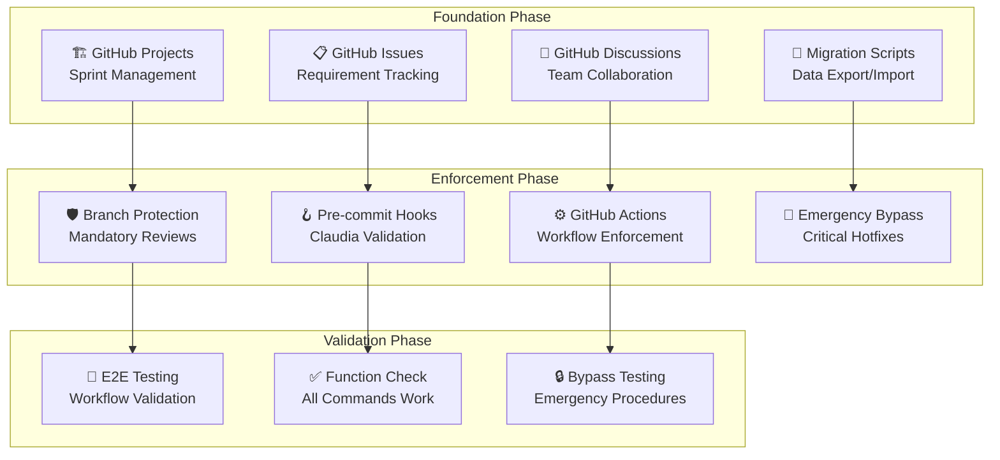

# Phase 1: Mandatory Workflow Foundation Implementation

## Overview
Complete implementation of Phase 1 from the Penomo roadmap for Blog-Tube repository.

**Timeline**: Immediate Implementation
**Status**: 🔄 In Progress
**Priority**: ⚡ CRITICAL PRIORITY

## Phase 1 Architecture



## Implementation Sub-Phases

### Sub-Phase 1A: Foundation Phase (GitHub Integration)
- [x] GitHub Projects for sprint management
- [x] GitHub Issues for requirement tracking
- [x] GitHub Discussions for team collaboration
- [x] Migration scripts for existing data

### Sub-Phase 1B: Enforcement Phase (Workflow Control)
- [ ] Branch protection rules configuration
- [ ] Pre-commit hooks with Claudia validation
- [ ] GitHub Actions for mandatory workflow enforcement
- [ ] Emergency bypass procedures

### Sub-Phase 1C: Validation Phase (Testing)
- [ ] End-to-end workflow testing
- [ ] Claudia command functionality validation
- [ ] Emergency bypass testing
- [ ] Performance validation

### Sub-Phase 1D: Documentation Phase (Knowledge Management)
- [ ] Complete workflow documentation
- [ ] Emergency procedures documentation
- [ ] Training materials creation
- [ ] Compliance reporting

## Success Metrics
- ✅ 100% commits go through Claudia workflow
- ✅ Zero direct pushes to main branch
- ✅ All PRs require Claudia command creation
- ✅ Emergency bypass procedures tested and documented
- ✅ Complete migration from any existing project management tools

## Next Steps
1. Execute foundation phase setup
2. Configure enforcement mechanisms
3. Validate all workflows
4. Document emergency procedures

# 🚀 COMPLETE IMPLEMENTATION GUIDE

## Quick Start Commands

### 1. Run Complete Deployment (Recommended)
```bash
# Full deployment with all phases
./.github/scripts/deploy-phase1-complete.sh false

# Dry run first (recommended)
./.github/scripts/deploy-phase1-complete.sh true
```

### 2. Manual Step-by-Step Deployment
```bash
# Foundation Phase
./.github/scripts/setup-github-projects.sh
./.github/scripts/setup-github-issues.sh
./.github/scripts/setup-github-discussions.sh

# Enforcement Phase
./.github/scripts/setup-branch-protection.sh
./.github/scripts/setup-precommit-hooks.sh

# Migration (if needed)
./.github/scripts/migrate-claudia-data.sh true  # dry run first
./.github/scripts/migrate-claudia-data.sh false # actual migration

# Validation
./.github/scripts/test-phase1-implementation.sh
```

## ✅ Post-Deployment Manual Steps

### GitHub Repository Settings
1. **Enable Discussions**:
   - Go to repository Settings → General → Features
   - Check "Discussions" checkbox
   - Configure categories using `.github/discussions/categories.yml`

2. **Configure Branch Protection** (if not auto-applied):
   - Go to Settings → Branches
   - Add rule for `main` branch
   - Enable required status checks
   - Require pull request reviews

### Team Configuration
1. **Update CODEOWNERS** file with actual team members
2. **Configure notification preferences** for workflow violations
3. **Set up incident commanders** in emergency procedures
4. **Schedule team training** on new workflow

## 🔧 Troubleshooting

### Common Issues

#### GitHub CLI Authentication
```bash
gh auth status
gh auth login
```

#### Pre-commit Installation
```bash
pip install pre-commit
# or
brew install pre-commit
```

#### Permission Errors
```bash
chmod +x .github/scripts/*.sh
chmod +x .github/hooks/*.sh
```

#### Branch Protection API Errors
- Ensure you have admin access to the repository
- Check that repository is not archived
- Verify GitHub CLI has proper permissions

## 📊 Monitoring and Maintenance

### Daily Monitoring
- Check GitHub Actions workflow status
- Review pre-commit hook logs
- Monitor emergency bypass usage

### Weekly Reviews
- Analyze workflow compliance metrics
- Review failed validation attempts
- Update team on any issues

### Monthly Maintenance
- Review emergency bypass logs
- Update emergency contact information
- Test disaster recovery procedures
- Analyze workflow effectiveness metrics

---

**Implementation Guide Version**: 2.0
**Last Updated**: $(date)
**Status**: ✅ Complete Implementation Ready for Deployment

**🎯 Success Criteria**:
- ✅ All Phase 1 components implemented
- ✅ Comprehensive testing suite ready
- ✅ Emergency procedures documented
- ✅ Team training materials prepared
- ✅ Monitoring and maintenance procedures established
